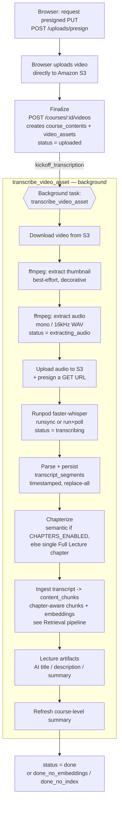
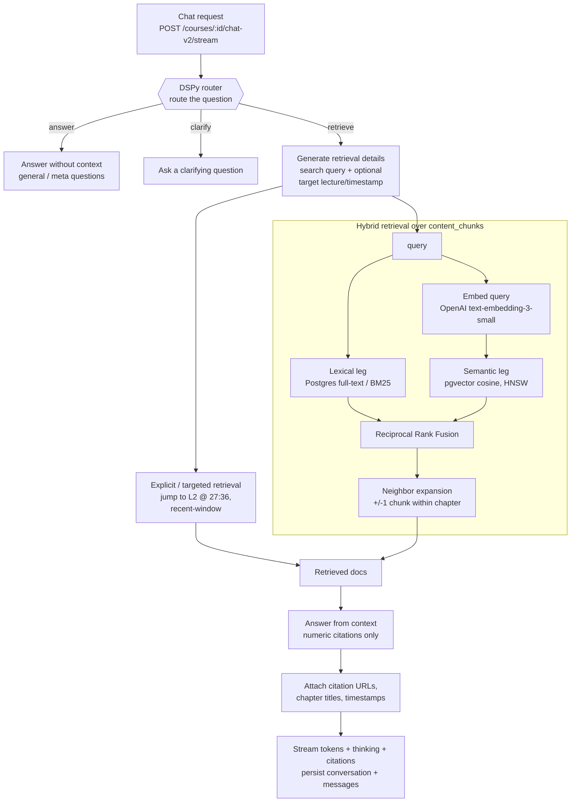

# Architecture: video processing & retrieval

This document covers the two most involved parts of ClassMate at a stage level:

1. **Video processing** — how an uploaded lecture becomes a transcript, chapters, AI summaries, and a searchable index.
2. **Retrieval (RAG)** — how a chat question turns into a grounded, cited answer.

For setup and the broader feature list, see the root [`README.md`](../README.md). Module paths below are clickable starting points, not an exhaustive map.

> **Scope note:** ClassMate is **video-only** in this version — enforced at every layer (the upload presign rejects non-`video/*`, the content schema allows only `category=media`, and a DB CHECK constraint enforces it). There is no PDF/notes/slides ingestion. So the retrieval corpus is **video transcripts only**, and "retrieval" everywhere below means transcript chunks.

---

## 1. Video processing pipeline

A lecture goes from raw upload to a fully searchable, summarized asset. The browser uploads directly to S3 via a presigned URL; everything after `finalize` runs server-side as a single background task (`transcribe_video_asset`), which advances `video_assets.status` through each stage.

### Stages

| Stage | What happens | Owner |
|------|--------------|-------|
| Presign & upload | Backend issues a presigned `PUT`; the browser uploads the video straight to S3 (the API never proxies the bytes). | `app/api/v1/uploads.py` |
| Finalize | One transaction creates the canonical `course_contents` row (`category=media`) and the linked `video_assets` row (1:1 via `content_id`). Idempotent on `source_file_key`. Optionally enqueues transcription. | `app/api/v1/video_assets.py` (`finalize_video_upload`) |
| Audio + thumbnail extraction | The video is streamed from S3 to a temp file; `ffmpeg` extracts a normalized mono/16 kHz WAV and a thumbnail frame (seek point adapts to video length). | `app/services/transcription.py` |
| Transcription | The extracted audio is uploaded back to S3, presigned, and handed to a Runpod serverless **faster-whisper** worker (`runsync`, or `run` + poll). Output is parsed into timestamped segments. | `app/services/transcription.py` (`RunpodClient`, `transcribe_video_asset`) |
| Chapters | Best-effort: semantic LLM chapterization when `CHAPTERS_ENABLED`, otherwise a single "Full Lecture" fallback chapter. Never fails the pipeline. | `app/services/video_chapters.py` |
| Indexing | Transcript segments are chunked (chapter-aware, duration-first) and written to `content_chunks` with embeddings — this is what makes the lecture searchable. | `app/services/transcript_chunk_ingestion.py` |
| AI artifacts | Best-effort generation of an AI title, description, and summary for the lecture, then a refresh of the course-level summary. Decoupled from indexing success. | `app/services/lecture_artifacts.py`, `app/services/course_summary.py` |

### Terminal status, and why it's not just done/error

Indexing and AI artifacts are deliberately **best-effort** — a transcript that can't be embedded is still useful for lexical search and playback, so the pipeline records *what* succeeded rather than failing wholesale:

- `done` — transcript chunked **and** embeddings written (full hybrid retrieval available).
- `done_no_embeddings` — chunked, but embeddings unavailable (e.g. no `OPENAI_API_KEY`); lexical/BM25 retrieval still works.
- `done_no_index` — transcript persisted but chunk ingestion failed; segments still play back and power explicit "jump to timestamp" retrieval.
- `error` — a hard failure before transcript segments existed (missing source, ffmpeg failure, Runpod failure/timeout).

The pipeline is resumable per-asset: `POST /video-assets/{id}/transcribe` (with `force` to re-run) re-enters the same background task.

---

## 2. Retrieval (RAG) pipeline

Chat is a **DSPy routed cascade**, not a single retrieve-then-answer call. The router decides whether a question even needs retrieval; only the `retrieve` branch hits the corpus. Answers stream back over SSE with inline citations that deep-link into the video player.

### Stages

| Stage | What happens | Owner |
|------|--------------|-------|
| Route | A DSPy signature classifies the question into `answer` (no retrieval needed), `clarify` (too ambiguous), or `retrieve`. Ambiguous coercion defaults toward `retrieve` so the assistant looks for evidence before answering. | `app/ai/teaching_assistant.py` |
| Generate retrieval details | For the `retrieve` branch, the model produces a search query and — when the user pointed at a specific spot ("lecture L2 at 27:36") — a target lecture slug + timestamp. | `app/ai/teaching_assistant.py`, `app/rag/explicit_retrieve.py` |
| Explicit / targeted retrieval | Pulls the exact transcript window for a referenced lecture+timestamp, plus a recent-window helper. Complements (doesn't replace) hybrid search. | `app/rag/explicit_retrieve.py` |
| Hybrid retrieval | Runs a **lexical** leg (Postgres full-text/BM25) and a **semantic** leg (pgvector cosine over OpenAI embeddings) in parallel, fuses them with **Reciprocal Rank Fusion**, then expands ±1 neighbor chunk within the same chapter for context. Scoped to specific lectures in SQL when chat is lecture-scoped. | `app/rag/hybrid_retrieve.py`, `app/rag/pg_retrieve.py`, `app/rag/embeddings.py` |
| Answer from context | A DSPy signature answers using only the retrieved docs and cites them with **numeric** keys (`[1]`, `[2]`). A post-step recovers any slug-style citations the model emits into the canonical numeric form. | `app/ai/teaching_assistant.py`, `app/api/v1/chat_v2.py` |
| Citations & streaming | Retrieved docs become `ChatCitation`s; URLs, chapter titles, and timestamps are attached so the UI can render inline pills that deep-link into the player. Tokens, model "thinking", and citations stream over SSE; the conversation and messages are persisted. | `app/services/chat_citations.py`, `app/api/v1/chat_v2.py` |

### Graceful degradation

Hybrid retrieval is designed to never hard-fail a chat turn:

- **No embeddings for the course** (none stored, or no API key): the semantic leg is skipped and retrieval is lexical-only — still useful, just not vector-ranked.
- **Embedding/query failure**: caught best-effort; the session is rolled back and the turn falls back to lexical-only rather than erroring.
- **Empty query / no hits**: returns nothing and the cascade answers accordingly instead of fabricating citations (the answer prompt forbids inventing citation numbers).

---

## Where the data lives

| Table | Role |
|------|------|
| `course_contents` | Canonical content items. Video-only today: `category` is constrained to `media`. |
| `video_assets` | Per-lecture processing state: status, transcription markers, `ai_title`/`ai_description`/`ai_summary`, thumbnail/audio keys. |
| `transcript_segments` | Timestamped transcript (source of truth for playback + explicit retrieval). |
| `video_chapters` | Chapter boundaries (semantic or the "Full Lecture" fallback). |
| `content_chunks` | The retrieval corpus: transcript chunks with `pgvector` embeddings + full-text search. |
| `chat_conversations` / `chat_messages` | Persisted chat (course- or lecture-scoped), including citations and model "thinking". |
