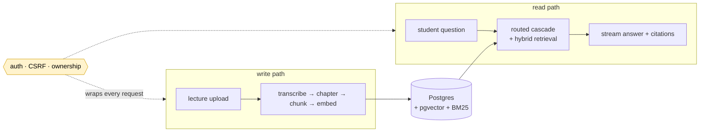

# ClassMate architecture

ClassMate is a study companion for **lecture videos**: upload a course's lectures, and it transcribes, summarizes, and indexes them so a student can chat with an AI assistant that answers *from what was actually said in class* — with citations that jump to the exact moment in the video.

This folder is the in-depth architecture documentation. Each doc covers one subsystem at a **design-decision** altitude (the *why*, not a line-by-line walkthrough), with Mermaid diagrams. For setup and the feature list, see the root [`README.md`](../README.md).

> **Scope note.** ClassMate is **video-only** in this version — the upload presign rejects non-`video/*` (finalize re-checks any supplied MIME type), and a DB CHECK constraint restricts content to `category = 'media'`. The retrieval corpus is **transcript chunks only**; there is no PDF/slides/notes ingestion.

---

## The system at a glance

Data flows in one direction — ingested, modeled, queried, delivered — with security wrapping the whole thing:

The two halves meet at Postgres: video processing **writes** the searchable corpus, and the RAG pipeline **reads** it. Postgres is the single store for both persistence *and* retrieval (vectors via `pgvector`, lexical via `pg_textsearch`).

---

## The five deep dives

Read in this order — it follows the data's lifecycle (model it → get it in → query it → deliver it), with security last because it cuts across all of them.

| # | Doc | What it covers |
|---|---|---|
| 1 | **[Data model](./data.md)** | The spine. Entities, ownership/cascade rules, the `content_chunks` dual index, idempotency & artifact-lineage patterns, and the video-only pivot baked into the schema. Read first — the others link back here for table shapes. |
| 2 | **[Video processing](./video-processing.md)** | The write path. Direct-to-S3 upload, the `transcribe_video_asset` background task, the `status` lifecycle and its best-effort terminal states (`done` / `done_no_embeddings` / `done_no_index`), chapter-aware chunking, resumability. |
| 3 | **[Teaching assistant: RAG & AI orchestration](./rag-and-ai.md)** | The read path. The DSPy routed cascade, the 5-step retrieval cascade, hybrid retrieval (BM25 + vector + RRF + neighbor expansion), per-task model tiering across three providers, citation discipline, and video-mode awareness. |
| 4 | **[Streaming UX](./streaming-ux.md)** | The delivery layer. The SSE event contract (thinking → status → citations → answer → done), the turn state machine, the typewriter, dual finalization, citation deep-links, and the live→persisted handoff. |
| 5 | **[Security](./security.md)** | The perimeter. Cookie auth + JWT, refresh-token rotation, double-submit CSRF, ownership-by-SQL (404-not-403), S3 key scoping — and an honest list of what's *not* implemented. |

There's also a look ahead: **[Coming soon](./coming-soon.md)** — the feedback → GEPA loop (per-answer star ratings, stage-level credit assignment, and gated prompt optimization). Designed and built on a side branch, not yet shipped.

---

## Stack, in one place

- **Frontend** — Vite + React 18 SPA; TanStack Query; TailwindCSS + shadcn/ui; `react-markdown` + KaTeX; SSE chat streaming.
- **Backend** — async FastAPI; SQLAlchemy (async) + Alembic; **Postgres** for persistence *and* retrieval (`pgvector` + `pg_textsearch`); **Amazon S3** (MinIO locally) for uploads; **ffmpeg** + **Runpod** (faster-whisper) for transcription; **DSPy** for the AI pipelines.
- **Models** — three providers, tiered per task: Anthropic (router/answers/lecture summaries), Gemini (chapters/course summary), OpenAI (embeddings). See [`rag-and-ai.md` §5](./rag-and-ai.md#5-model-orchestration-one-job-one-tier).
