# ClassMate — Code Report

**Author:** Yuval Levy

## ClassMate Overview

ClassMate is a study companion for **lecture videos**: upload a course's lectures, and it transcribes, summarizes, and indexes them so a student can chat with an AI assistant that answers _from what was actually said in class_ — with citations that jump to the exact moment in the video.

## Contents

1. [Data model](#data-md)
2. [Video processing](#video-processing-md)
3. [Teaching assistant: RAG pipeline & AI orchestration](#rag-and-ai-md)
4. [Future direction: the feedback → GEPA loop](#coming-soon-md)

---

### Tech Stack

- **Frontend** — Vite + React 18 SPA; TanStack Query; TailwindCSS + shadcn/ui; `react-markdown` + KaTeX; SSE chat streaming.
- **Backend** — async FastAPI; SQLAlchemy (async) + Alembic; **Postgres** for persistence _and_ retrieval (`pgvector` + `pg_textsearch`); **Amazon S3** for uploads; **ffmpeg** + **Runpod** (faster-whisper) for transcription; **DSPy** for the AI pipelines.
- **Models** — three providers, tiered per task: Anthropic (haiku and sonnet for router/answers/lecture summaries), Gemini (flash 2.5 for chapters/course summary), OpenAI (embeddings).

---

## Data model

### Where the data lives

A one-line role for each table, as a quick reference:

| Table                 | Role                                                                                            |
| --------------------- | ----------------------------------------------------------------------------------------------- |
| `users`               | Identity + credentials; everything in the system belongs to a user.                             |
| `refresh_sessions`    | Stores a hashed token and a link to the token that replaced it.                                 |
| `courses`             | A course - groups its lectures and carries the AI-written course overview.                      |
| `course_contents`     | Holds the S3 Key.                                                                               |
| `video_assets`        | A lecture - processing status, extracted audio/thumbnail, and its AI title/description/summary. |
| `transcript_segments` | Segments produced by faster-whisper.                                                            |
| `content_chunks`      | What the AI actually searches - grouped segments.                                               |
| `chat_conversations`  | Chat threads — cross course + video chats.                                                      |
| `chat_messages`       | Each message in a thread, plus the sources the AI cited and its reasoning.                      |

### The entity graph

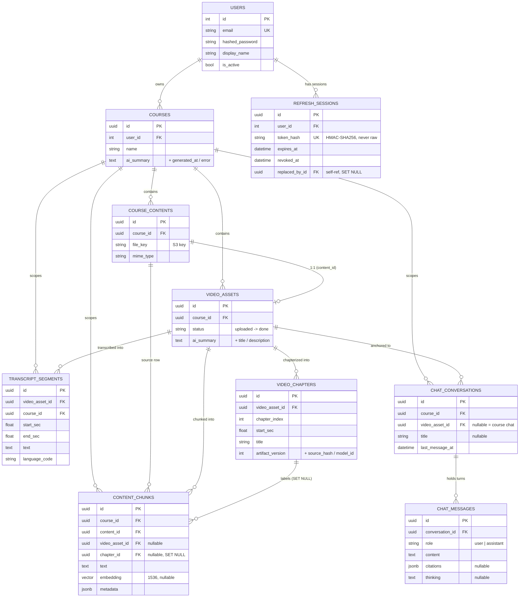

---

### Ownership and cascade rules

Deleting a user erases everything they own, in one cascade. The FKs are wired so the database does the cleanup — there is no application-level "delete all the children" code to keep in sync.

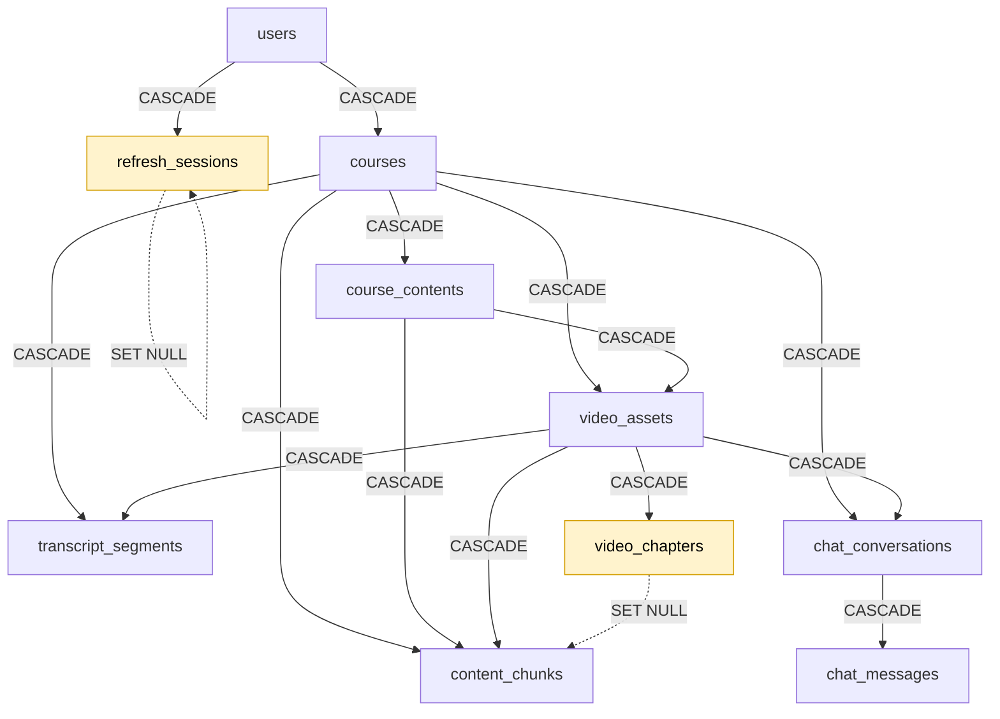

Almost every edge is `CASCADE`. The two exceptions (dashed) are the design decisions worth calling out — both choose to **preserve a row and null a pointer** rather than delete:

| Relationship                                     | Rule         | Why not CASCADE                                                                                                                                                                                                                                                                                                                                                                                                   |
| ------------------------------------------------ | ------------ | ----------------------------------------------------------------------------------------------------------------------------------------------------------------------------------------------------------------------------------------------------------------------------------------------------------------------------------------------------------------------------------------------------------------- |
| `video_chapters` → `content_chunks.chapter_id`   | **SET NULL** | Chapters are a _best-effort label_ on a chunk, not its reason for existing. Re-running chapterization deletes and recreates chapter rows; if that cascaded, it would wipe the retrieval corpus every time chapters regenerated. Nulling `chapter_id` lets a chunk outlive the chapter that happened to label it. (See the [chapters note](#a-note-on-chapters) — even dormant, this row is wired into retrieval.) |
| `refresh_sessions` → `replaced_by_id` (self-ref) | **SET NULL** | The rotation chain is auditing metadata, not a hard dependency. Pruning an old session shouldn't fail because a newer one points back at it.                                                                                                                                                                                                                                                                      |

Everything else cascades because the child genuinely has no meaning without its parent: a transcript segment without its video, a chat message without its conversation.

---

### The retrieval corpus: `content_chunks`

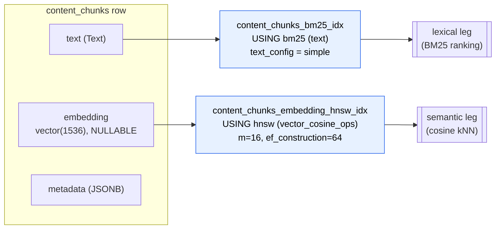

Both indexes come from Postgres extensions

- **`pg_textsearch`** provides the `bm25` access method. The index uses the language-agnostic `simple` config — no stemming or stop-word removal, which is the safe default for mixed/unknown lecture languages (although now we only support English).
- **`vector`** (pgvector) provides the `vector(d)` column type and the `hnsw` index. We are using `EMBEDDING_DIMS = 1536`.

---

## Video processing

This is the **write path**: how a raw lecture video becomes a transcribed, chaptered, summarized, and _searchable_ asset. It's the half of the system that runs before anyone asks a question — the [RAG pipeline](#rag-and-ai-md) is the read path that consumes what this produces.

The tables this writes to: `video_assets`, `transcript_segments`, `video_chapters`, `content_chunks`.

> **Where the code lives:** `app/api/v1/uploads.py` (presign), `app/api/v1/video_assets.py` (finalize + transcribe endpoints), and `app/services/transcription.py` (the background task). Chunking is `app/services/transcript_chunk_ingestion.py`; chapters `app/services/video_chapters.py`; AI artifacts `app/services/lecture_artifacts.py` + `course_summary.py`.

---

### 1. The upload handshake

The API **never proxies video bytes**. The browser uploads straight to S3 through a presigned `PUT`, and only then tells the backend "it's there." This keeps large uploads off the application server entirely.

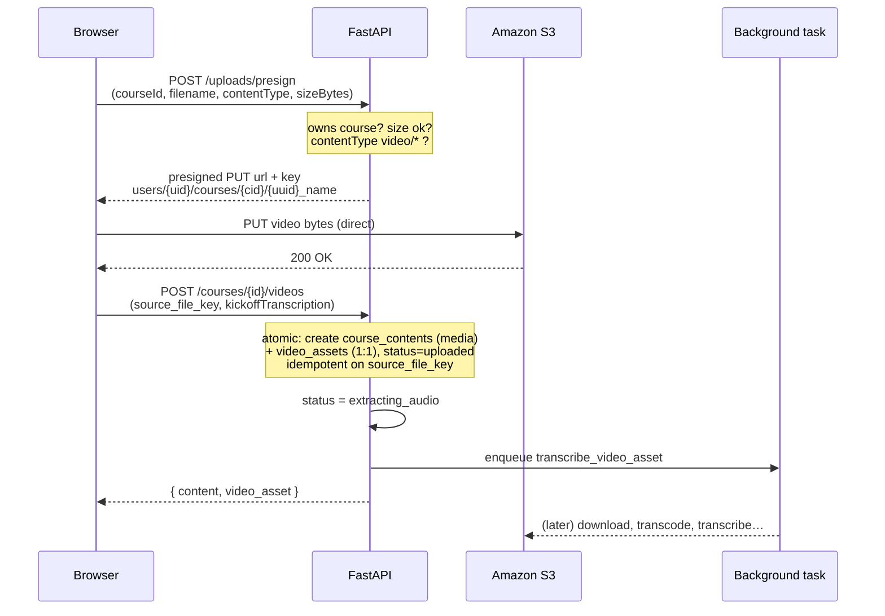

---

### 2. The status lifecycle

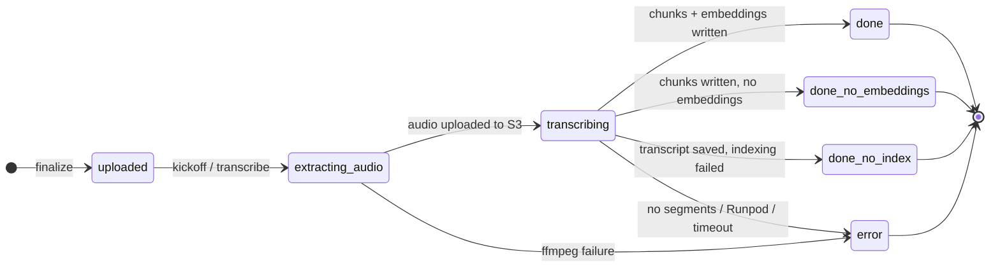

---

### 3. Inside the background task

**Part 1 — acquire audio, then transcribe & persist:**

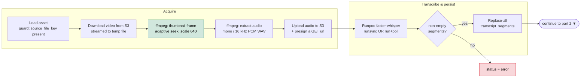

**Part 2 — index for retrieval, then generate artifacts:**

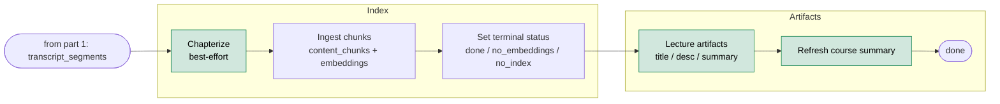

Green stages are **best-effort** — they're wrapped in `try/except` and can never fail the pipeline. Red is the only kind of fatal: a hard failure before a transcript exists.

| Stage          | What happens                                                                                                                                  | Failure mode                                       |
| -------------- | --------------------------------------------------------------------------------------------------------------------------------------------- | -------------------------------------------------- |
| Download       | Streams the S3 object to a temp file (never loads the whole video into memory).                                                               | Missing key → `error`.                             |
| Thumbnail      | One ffmpeg frame for the library UI. Seek point adapts — longer videos seek further in to skip black intro frames (`ffprobe` reads duration). | Best-effort; skipped on failure.                   |
| Audio          | ffmpeg normalizes to mono / 16 kHz PCM WAV — the format faster-whisper wants.                                                                 | ffmpeg failure → `error` ("ffmpeg failed").        |
| Upload audio   | WAV goes back to S3 and is presigned, because Runpod fetches it over HTTPS (it can't reach your S3 credentials).                              | Exception → `error`.                               |
| Transcribe     | Runpod serverless faster-whisper. Output parsed into timestamped segments.                                                                    | Job failure / timeout / **no segments** → `error`. |
| Persist        | **Replace-all** for `(video_asset_id, language_code)` — re-running is safe.                                                                   | —                                                  |
| Chapters       | Best-effort; see [below](#chapters-dormant-but-wired).                                                                                        | Never fails the pipeline.                          |
| Ingest         | Chunk + embed into `content_chunks`; decides the terminal `done_*` status.                                                                    | Failure → `done_no_index` (transcript survives).   |
| Artifacts      | AI title / description / summary, only if missing.                                                                                            | Best-effort.                                       |
| Course summary | Re-roll the course-level summary now a new lecture exists.                                                                                    | Best-effort.                                       |

---

### 4. From transcript to retrieval corpus

Persisting `transcript_segments` makes a lecture _playable_. Making it _searchable_ is a separate step: `ingest_video_asset_transcript_to_chunks` rewrites the raw whisper segments into retrieval-sized chunks in `content_chunks`.

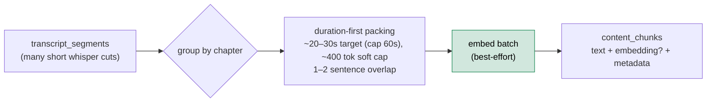

**Why re-chunk at all?** Whisper emits many short cuts (a few seconds each) — too granular to retrieve against. The ingester packs them into **duration-first** chunks: a chunk flushes once it holds roughly 20–30 seconds of speech (soft cap 60s — an oversized single segment is kept whole), with a soft ~400-token bound to avoid runaway chunks and a 1–2 sentence overlap so a concept split across a boundary is still findable from either side. Duration is the primary axis because it maps to "a coherent thing the lecturer said," and it gives every chunk a clean `[start_sec, end_sec]` for timestamp-deep-linked citations.

Chunks are computed **per chapter** (each chunk gets a `chunk_index_in_chapter`), which is what later powers chapter-scoped neighbor expansion at query time. Embedding is a **best-effort batch**: if `get_embeddings` returns vectors of the right count and dimensionality (1536) they're written, otherwise the chunks land embedding-less and the lecture becomes `done_no_embeddings`. The whole write is **replace-all by `content_id`**, so re-ingesting a lecture cleanly supersedes the old chunks.

Each chunk also carries a small `metadata` JSON blob (`video_asset_id`, `start_sec`/`end_sec`, `language_code`, `title`, `chapter_title`, plus `doc_type`, `source_kind`, and `original_filename`) used to render citations without extra joins.

Semantic chapterization is **feature-flagged off by default** (`CHAPTERS_ENABLED=false`) and not surfaced in the player UI — so as a feature it's dormant.

---

## Teaching assistant: RAG pipeline & AI orchestration

This is the **read path**: how a student's question becomes a grounded, cited answer. It consumes exactly what the last section produced — the `content_chunks` corpus and `transcript_segments` — and turns it into an answer that links back to the moment in the video.

> **Where the code lives:** `app/ai/teaching_assistant.py` is the orchestrator (the DSPy module + cascade). Retrieval is `app/rag/` — `course_retriever.py` (the cascade), `hybrid_retrieve.py` (BM25 + vector + RRF), `explicit_retrieve.py` (timestamp/deictic). Model tiering is `app/ai/model_roles.py` + `llm.py`. Citation post-processing is `app/services/chat_citations.py` + `app/api/v1/chat_v2.py`.

---

### 1. The routed cascade

A chat turn runs through a DSPy module (`TeachingAssistant`) that routes first, then acts:

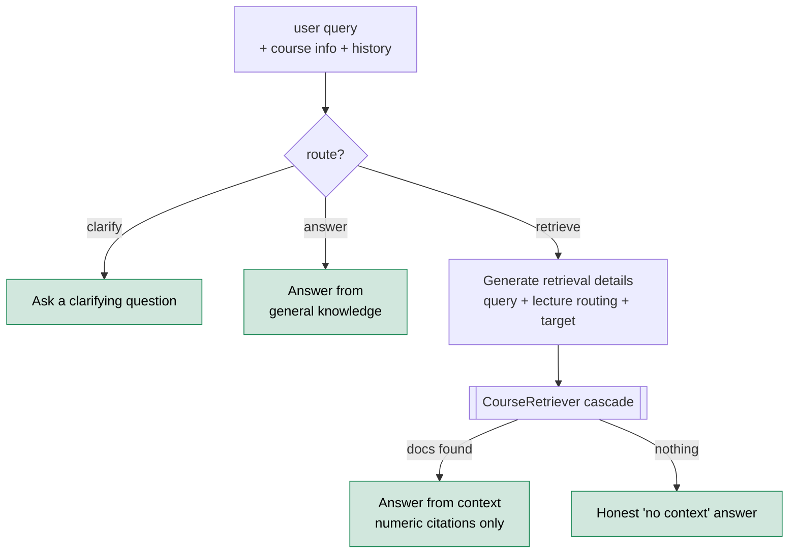

The router classifies into three actions:

- **`answer`** — answerable from general knowledge (definitions, "what's this course about"). No retrieval; saves latency and tokens.
- **`clarify`** — too ambiguous to answer or search. Ask one direct question and stop.
- **`retrieve`** — needs specifics from the lectures. Generate a search query, run the cascade, answer from what came back.

When the router emits anything outside this set, normalization **defaults to `retrieve`** — better to look for evidence than to guess. And if the `retrieve` branch finds nothing, it doesn't fabricate: it routes to an honest "I couldn't find that in the lectures" answer (the prompt is primed with a system note that retrieval came back empty).

Each step is a **DSPy signature** — a typed input/output contract — wrapped in a module:

| Signature                  | Module           | Purpose                                                                       |
| -------------------------- | ---------------- | ----------------------------------------------------------------------------- |
| `RouteQuery`               | `ChainOfThought` | Classify into answer / retrieve / clarify.                                    |
| `AskClarification`         | `Predict`        | Produce a clarifying question.                                                |
| `AnswerWithoutContext`     | `ChainOfThought` | General-knowledge answer.                                                     |
| `GenerateRetrievalDetails` | `ChainOfThought` | Emit a self-contained query, lecture routing, and an optional jump-to target. |
| `AnswerFromContext`        | `ChainOfThought` | Answer using only retrieved docs, with strict numeric citations.              |

We also utilize DSPy's **`streamify`** for token streaming to get the "thinking" effect in the chat.

---

### 2. The retrieval cascade

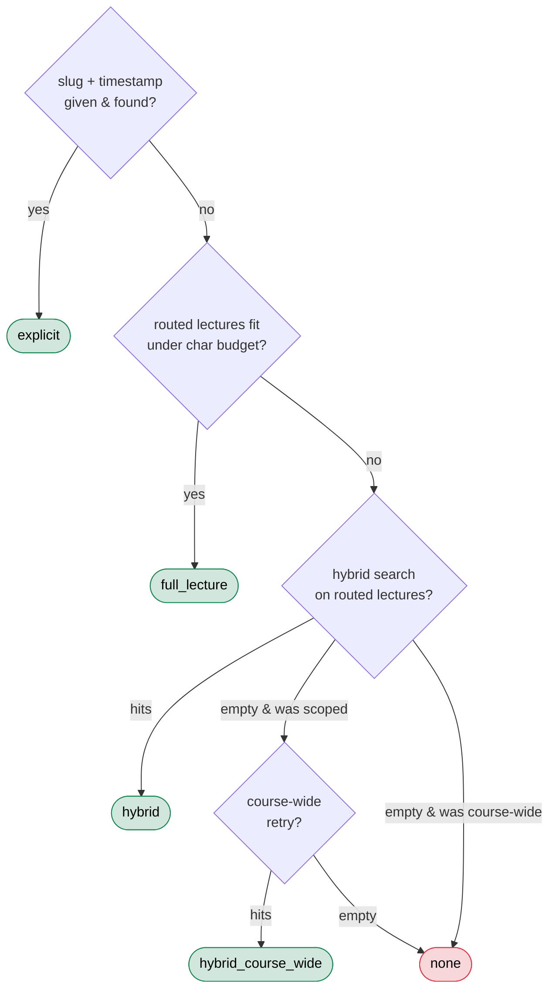

| Path                 | When it fires                                                               | Strategy                                                                                            |
| -------------------- | --------------------------------------------------------------------------- | --------------------------------------------------------------------------------------------------- |
| `explicit`           | The model resolved a `(lecture, timestamp)` target — "in L2 at 27:36…".     | Deterministic window around that moment ([§3](#3-explicit--deictic-retrieval-the-chapters-payoff)). |
| `full_lecture`       | One or a few routed lectures whose full transcript fits a character budget. | Feed the whole transcript — no lossy chunking when it's cheap to read it all.                       |
| `hybrid`             | The routed lectures are too big for full-text; search within them.          | BM25 + vector + RRF, scoped to those lectures ([§4](#4-hybrid-retrieval)).                          |
| `hybrid_course_wide` | A _scoped_ hybrid search came back empty.                                   | Retry across the whole course — rescues a confident-but-wrong lecture pick.                         |
| `none`               | Nothing matched anywhere.                                                   | Caller switches to the honest "no context" answer.                                                  |

---

### 3. Hybrid retrieval

For the `hybrid` paths, two independent legs run over `content_chunks` and get fused:

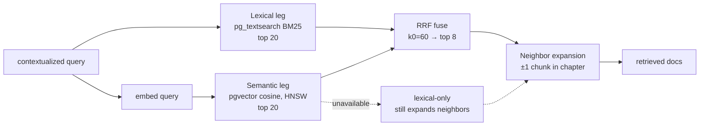

- **Lexical leg** — Postgres `pg_textsearch` BM25 over the chunk text. Always runs.
- **Semantic leg** — embed the query (OpenAI `text-embedding-3-small`, 1536-dim) and rank by pgvector cosine distance over the HNSW index. **Best-effort.**
- **RRF fusion** — [Reciprocal Rank Fusion] each leg contributes `1/(k0 + rank)` per hit (`k0=60`), summed across legs, deduped by `chunk_id` (with `id` / content-prefix fallbacks), top 8. RRF needs no score calibration between the two legs — it works purely on ranks, which is what makes mixing BM25 scores with cosine distances clean.
- **Neighbor expansion** — after fusion, pull ±1 neighboring chunk

---

## Future direction: the feedback → GEPA loop

ClassMate's next feature closes the loop between students and the AI pipeline: students **rate answers**, low ratings say **what went wrong**, and that signal becomes training data for **[GEPA](https://dspy.ai/api/optimizers/GEPA/)** — DSPy's reflective prompt optimizer — which rewrites the tutor's prompts and ships them back to production behind a gate. A star rating becomes stage-level training signal.

> **Status: designed and built, not yet shipped.** The frontend ("Help ClassMate learn") lives on this branch behind `VITE_FEEDBACK_ENABLED` (off by default) and currently runs on a localStorage stub. The backend — feedback API, answer snapshots, and the whole optimization harness — exists as work-in-progress on the **`feedback-gepa-backend`** branch.

---

### The loop at a glance

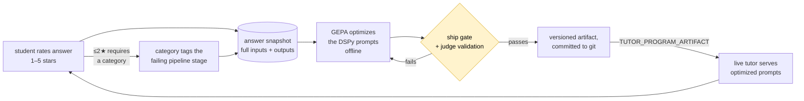

---

### 1. Capturing feedback

#### The UX (already built, behind the flag)

- A global **"Help ClassMate learn"** opt-in toggle in the account menu (Navbar). Everything is consent-first — no opt-in, no rating UI, no data capture.
- Under each finished, persisted assistant answer (course chat and video chat): a **1–5 star** rating row. Picking a rating opens a popover — a **rating ≤ 2★ requires a "what went wrong?" category** (that's the credit-assignment signal, so there's no skip button); higher ratings take an optional comment. Submitted feedback collapses to a compact "Thanks — noted ★★★☆☆" with an edit link.
- Ratings only appear on _persisted_ messages — the message id is what feedback and snapshots key on.

---

### 2. Credit assignment: category → stage

The four "what went wrong?" categories map to the pipeline stage that can fix them:

| Category (UI label)                                               | Stage blamed                            |
| ----------------------------------------------------------------- | --------------------------------------- |
| `unnecessary_clarification` — "Asked me to clarify unnecessarily" | **router**                              |
| `wrong_lecture` — "Wrong / missing lecture"                       | **query_generator** (retrieval details) |
| `bad_answer` — "Answer wrong, vague, or too long"                 | **answer** step                         |
| `other` — "Something else"                                        | _none_ — no reliable attribution        |

This mapping lives in a dependency-free module (`app/schemas/feedback.py`) so both the API and the offline optimizer import it without pulling DSPy into the request path. During optimization, the metric routes the student's verbatim comment **only to the blamed predictor** — the router never hears about a bad answer, and vice versa. Untagged feedback (≥3★ or `other`) falls back to heuristics: routing predictors hear about retrieval recall, the answer predictor hears the LLM judge.
