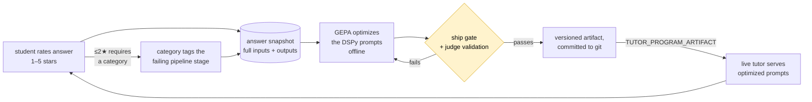

# Coming soon: the feedback → GEPA loop

ClassMate's next feature closes the loop between students and the AI pipeline: students **rate answers**, low ratings say **what went wrong**, and that signal becomes training data for **[GEPA](https://dspy.ai/api/optimizers/GEPA/)** — DSPy's reflective prompt optimizer — which rewrites the tutor's prompts and ships them back to production behind a gate. A star rating becomes stage-level training signal.

> **Status: designed and built, not yet shipped.** The frontend ("Help ClassMate learn") lives on this branch behind `VITE_FEEDBACK_ENABLED` (off by default) and currently runs on a localStorage stub. The backend — feedback API, answer snapshots, and the whole optimization harness — exists as work-in-progress on the **`feedback-gepa-backend`** branch. Everything below describes that design; names and thresholds may still shift before merge.

> **Where the code lives.** Frontend (this branch): `src/components/chat/AnswerFeedback.jsx` (the rating row), `src/hooks/useFeedbackOptIn.js` + the Navbar toggle, `src/api/feedback.js` (stub API, documents the real endpoints), `src/lib/featureFlags.js`. Backend (`feedback-gepa-backend` branch): `app/api/v1/feedback.py`, `app/schemas/feedback.py`, `app/db/models/answer_snapshot.py` + `app/services/answer_snapshots.py`, and the offline package `app/ai/optimization/` driven by `scripts/optimize_tutor.py`.

---

## The loop at a glance

The design has three load-bearing ideas:

1. **Per-stage credit assignment.** A low rating doesn't just say "bad" — the student picks *what went wrong*, and each reason maps to the pipeline stage that can fix it (router, retrieval query, or the answer step). The optimizer's reflection sees the student's words only on the predictor being blamed.
2. **Snapshots, not logs.** Every rated answer is reconstructable: the exact inputs (course info, history, viewing context) and outputs (route, retrieval, raw answer) are captured at answer time, so the optimizer re-runs candidates on *exactly* what the student saw.
3. **Gated shipping.** Optimized prompts only deploy when they beat the live program on a frozen holdout *and* the LLM judge demonstrably correlates with human ratings. Deployment is one env var; rollback is unsetting it.

---

## 1. Capturing feedback

### The UX (already built, behind the flag)

- A global **"Help ClassMate learn"** opt-in toggle in the account menu (Navbar). Everything is consent-first — no opt-in, no rating UI, no data capture.
- Under each finished, persisted assistant answer (course chat and video chat): a **1–5 star** rating row. Picking a rating opens a popover — a **rating ≤ 2★ requires a "what went wrong?" category** (that's the credit-assignment signal, so there's no skip button); higher ratings take an optional comment. Submitted feedback collapses to a compact "Thanks — noted ★★★☆☆" with an edit link.
- Ratings only appear on *persisted* messages — the message id is what feedback and snapshots key on.

### The API (backend branch)

| Endpoint | Purpose |
|---|---|
| `PATCH /api/v1/users/me` | Toggle `feedback_opt_in` on the user. |
| `PATCH /api/v1/messages/{id}/feedback` | Rate an assistant answer: `{rating, comment, category}`. |

Validation mirrors the UI: rating bounded 1–5, comment capped at 2,000 chars (comments get pasted verbatim into GEPA reflection prompts), and a `≤2★` rating without a category is a 422. Ownership is checked transitively (message → conversation → course → user) and returns **404, not 403** — same no-existence-leak discipline as the rest of the API ([`security.md`](./security.md) §5). Rating a non-assistant message is a 400; rating without opt-in is a 403.

Storage is three nullable columns on `chat_messages` (`rating`, `comment`, `feedback_category`) plus `users.feedback_opt_in` — and each message's saved feedback rides back on the conversation-history payload, so reloading a chat shows your prior rating.

### The consent double-gate

Two flags gate everything, both off by default:

- **`FEEDBACK_ENABLED`** (server) — when off, the feedback endpoints return 404 (invisible, not forbidden) and no snapshots are captured. Pairs with **`VITE_FEEDBACK_ENABLED`** (client).
- **`users.feedback_opt_in`** (per student) — gates rating, gates snapshot capture, and is re-checked at *training time*: the dataset builder excludes snapshots from users who have since opted out, so opting out is retroactive.

---

## 2. Answer snapshots: the training corpus

Rating a message is only useful if the answer can be *replayed*. When feedback is enabled and the user is opted in, every assistant answer also writes one row to a new `answer_snapshots` table (1:1 with the message, cascade-deletes with it):

- **Reconstructable inputs** — the user query, a point-in-time JSON dump of the `CourseInfo` the tutor saw, the conversation history, and the viewing context (if the student was watching a lecture).
- **What the program produced** — the *raw* answer (numeric `[N]` citation markers intact, before link rewriting), the route taken, the retrieval path, the generated retrieval parameters, and the full retrieved-docs list.
- **Weak retrieval gold** — the lecture slugs the answer actually cited, parsed from the raw answer. On a 4–5★ answer these are trusted as "retrieval got the right lectures" labels.
- **`program_version`** — the prompt version (`CHAT_PROMPT_VERSION`, default `v0`) the answer was generated under. The optimizer trains only within one version, so feedback on old prompts never leaks into evaluating new ones. Bump it whenever the tutor's prompts change — including after shipping an optimized artifact.

Snapshot capture is deliberately **non-fatal and transactionally separate**: the message commits first in its own transaction, then the snapshot in another. A failed snapshot logs a warning and never loses the student's answer — the streaming and non-streaming chat paths share this invariant (it's pinned by a poisoned-snapshot test).

---

## 3. Credit assignment: category → stage

The four "what went wrong?" categories map to the pipeline stage that can fix them:

| Category (UI label) | Stage blamed |
|---|---|
| `unnecessary_clarification` — "Asked me to clarify unnecessarily" | **router** |
| `wrong_lecture` — "Wrong / missing lecture" | **query_generator** (retrieval details) |
| `bad_answer` — "Answer wrong, vague, or too long" | **answer** step |
| `other` — "Something else" | *none* — no reliable attribution |

This mapping lives in a dependency-free module (`app/schemas/feedback.py`) so both the API and the offline optimizer import it without pulling DSPy into the request path. During optimization, the metric routes the student's verbatim comment **only to the blamed predictor** — the router never hears about a bad answer, and vice versa. Untagged feedback (≥3★ or `other`) falls back to heuristics: routing predictors hear about retrieval recall, the answer predictor hears the LLM judge.

---

## 4. Offline optimization with GEPA

Everything below runs offline via `uv run scripts/optimize_tutor.py` — the `app/ai/optimization/` package is never imported by the request path.

### The program under optimization

`TutorProgram` is a synchronous mirror of the production `TeachingAssistant` cascade ([`rag-and-ai.md`](./rag-and-ai.md) §1) — same five predictors (`router`, `query_generator`, `clarifier`, `answer_without_context`, `answer_from_context`), same signatures, same per-role model tiers, and **live retrieval** against the real corpus (a sync wrapper runs the async `CourseRetriever` on a dedicated event-loop thread). Optimized instructions therefore transfer back to production unchanged, matched by predictor name.

### Dataset: a frozen holdout

Rated snapshots become `dspy.Example`s (inputs + rating, comment, blamed stage, cited-slug gold). The split has one non-obvious property: holdout membership is a **stable hash of the example**, not a random draw — as the dataset grows, no example ever migrates from train to holdout. Since optimization warm-starts from the currently-deployed artifact, an unfrozen holdout would leak training examples into the ship gate. The split is also stratified by rating band so low-star failures land in both sides.

### The metric: recall + judge, feedback per stage

Each candidate answer is scored by a blend:

- **Retrieval recall** against the cited-slug gold — but only when the original answer earned ≥4★ (below that, its citations aren't trusted as gold).
- **An LLM judge** (the flagship answer-tier model at temperature 0) grading correctness, groundedness, citation discipline, and concision — primed with the student's original rating and comment.

The human rating itself is deliberately *not* an additive term: it's constant per example, so it can't change candidate ranking — it steers via the judge's context and the feedback text instead. GEPA's reflection model then rewrites instructions per predictor, guided by the stage-routed feedback.

### Trust but verify the judge

Before anything ships, `validate_judge` scores the *historical* answers on the holdout **without seeing the ratings** and correlates judge scores against the human 1–5 ratings (Spearman preferred). If the judge doesn't demonstrably agree with students, its opinion can't ship a prompt.

---

## 5. Shipping: gates, artifacts, rollback

A run only persists an artifact when the **ship gate** passes:

1. Optimized program beats the baseline on the frozen holdout by more than `SHIP_MARGIN` (0.02).
2. The holdout is big enough to mean anything (`MIN_HOLDOUT`, currently 5 — demo-scale, would be raised in production).
3. Judge–human correlation clears `MIN_JUDGE_CORR` (0.2).

The baseline is not the hand-written prompts — it's **whatever is currently live**: the run warm-starts from the deployed artifact, so a candidate that's worse than production can never pass, and prior optimization progress compounds instead of being discarded.

Artifacts are JSON DSPy state (instructions + demos), named `tutor.{prompt_version}.json` with a manifest (scores, counts, lineage), and **committed to git deliberately** — history is an auditable deploy log, and rollback is a revert. Deployment is config, not code:

- `TUTOR_PROGRAM_ARTIFACT=<path>` — the live tutor loads the artifact at startup (lazily, so optimization deps stay out of the request path). A bad or partial artifact falls back to the clean hand-written baseline rather than serving a half-optimized mix.
- Unset the variable → **instant rollback** to the baseline prompts.

---

## 6. Experimental: per-stage optimization

`optimize_tutor.py --stage <router|query_generator|answer>` optimizes one predictor in isolation — un-confounded signal, cheaper rollouts, a metric tailored per stage (the router's is judge-free; the answer stage replays the originally-retrieved docs). A **composition gate** then re-checks the winning stage artifact composed into the full cascade against the end-to-end holdout, blocking any stage win that regresses the whole.

It's explicitly not graduated yet, for two honest reasons: the stage metrics haven't been validated on real data (known sharp edge: with no "clarifying was correct" examples in the dataset, *never clarify* games the router metric — mitigated by seeding hand-written ambiguous queries), and the composition gate hasn't blocked or passed a real run yet.

---

## What's left before this ships

- **Merge the backend** (`feedback-gepa-backend`): feedback API, migrations (`0027`, `0028`), snapshot capture, the optimization package — and its DSPy 3.x upgrade.
- **Swap the frontend stub for the real API** — `src/api/feedback.js` documents the exact swap; the opt-in then comes from the `users/me` payload and saved ratings ride on message history, so the localStorage seams disappear.
- **Turn both flags on** (`FEEDBACK_ENABLED` + `VITE_FEEDBACK_ENABLED`) and collect real ratings.
- **Run the loop for real** — thresholds are tuned for demo-scale data today; a production pass needs a bigger holdout and the stage-metric validation above.
