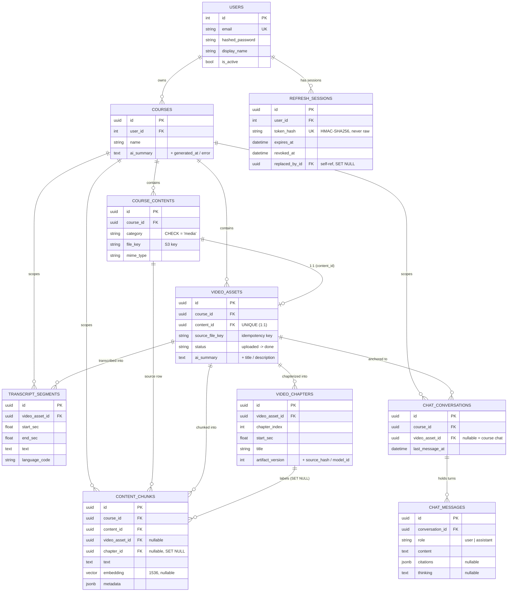
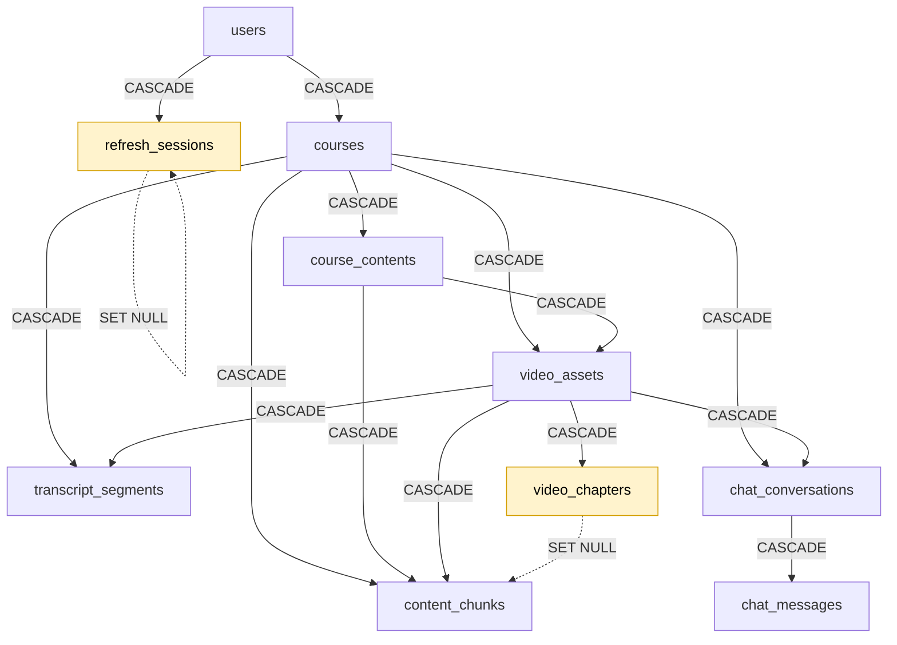
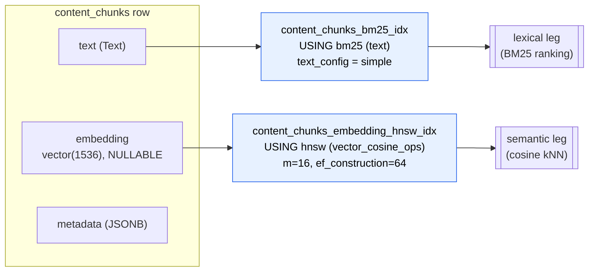

# Data model

This is the **spine** of ClassMate. Every other deep-dive looks at the data through its own keyhole — this document is the map that shows the whole shape at once.

It covers **structure at rest**: the entities, how they relate, the keys and constraints that hold them together, and the cross-cutting patterns that repeat across tables. It deliberately does **not** cover behavior over data — how a lecture moves through its `status` states, how the two indexes on `content_chunks` get fused at query time, or how refresh tokens rotate. Those live in the feature docs, which link back here for the table definitions:

- Status transitions, the processing pipeline → [`video-processing.md`](./video-processing.md)
- How `content_chunks` is queried (BM25 + vector + RRF) → [`rag-and-ai.md`](./rag-and-ai.md)
- How `chat_*` rows are produced and streamed → [`streaming-ux.md`](./streaming-ux.md)
- The refresh-session rotation protocol → [`security.md`](./security.md)

> **Scope note.** ClassMate is **video-only** in this version, and that pivot is baked into the schema (see [Schema evolution](#schema-evolution)). The retrieval corpus is **transcript chunks only**. There is no PDF/slide/notes ingestion — the tables that once supported it were dropped in migration `0022`.

The source of truth is `app/db/models/*.py` (the ORM models) and `alembic/versions/*.py` (the DDL, including everything the ORM doesn't express: extensions, the BM25/HNSW indexes, and CHECK/UNIQUE constraints).

---

## The entity graph

Ten tables, anchored on a single ownership root (`users`). Everything cascades down from a user, and almost everything is scoped by `course_id` so retrieval and authorization can filter on one column.



Two structural facts worth reading off the diagram:

- **`course_id` is everywhere.** `transcript_segments`, `content_chunks`, and `chat_conversations` all carry `course_id` directly even though they could reach it through a parent. That denormalization is deliberate — it lets retrieval and ownership checks filter on a single indexed column without joins.
- **`video_assets` is the hub of the video world.** It owns segments, chapters, and chunks, and it's the optional anchor for a conversation. Its 1:1 partner is `course_contents` (the library row the UI lists), linked by a `UNIQUE` `content_id`.

---

## Ownership and cascade rules

Deleting a user erases everything they own, in one cascade. The FKs are wired so the database does the cleanup — there is no application-level "delete all the children" code to keep in sync.



Almost every edge is `CASCADE`. The two exceptions (dashed) are the design decisions worth calling out — both choose to **preserve a row and null a pointer** rather than delete:

| Relationship | Rule | Why not CASCADE |
|---|---|---|
| `video_chapters` → `content_chunks.chapter_id` | **SET NULL** | Chapters are a *best-effort label* on a chunk, not its reason for existing. Re-running chapterization deletes and recreates chapter rows; if that cascaded, it would wipe the retrieval corpus every time chapters regenerated. Nulling `chapter_id` lets a chunk outlive the chapter that happened to label it. (See the [chapters note](#a-note-on-chapters) — even dormant, this row is wired into retrieval.) |
| `refresh_sessions` → `replaced_by_id` (self-ref) | **SET NULL** | The rotation chain is auditing metadata, not a hard dependency. Pruning an old session shouldn't fail because a newer one points back at it. |

Everything else cascades because the child genuinely has no meaning without its parent: a transcript segment without its video, a chat message without its conversation.

---

## The retrieval corpus: `content_chunks`

This is the most load-bearing table and the one with the most schema design in it. It's the **single source of truth for retrieval** — one row per chunk of searchable text, with *both* a lexical and a semantic index over the same `text` column.



Both indexes come from Postgres extensions enabled in migrations, not from the ORM:

- **`pg_textsearch`** provides the `bm25` access method (migration `0013`). The index uses the language-agnostic `simple` config — no stemming or stop-word removal, which is the safe default for mixed/unknown lecture languages.
- **`vector`** (pgvector) provides the `vector(d)` column type and the `hnsw` index (migration `0015`).

### Three design decisions in this one table

**1. The embedding column is nullable.** A chunk is useful the moment its `text` is indexed for BM25 — the embedding can arrive later (or never). This makes vector search a *backfill*, not a prerequisite: a course with no `OPENAI_API_KEY` still has fully working lexical retrieval, and embeddings can be added to existing chunks without re-ingesting. (How the query side copes with missing embeddings is the RAG doc's job.)

**2. Embedding dimensionality is pinned and centralized.** pgvector requires a fixed dimension in the schema (`vector(1536)`). That number lives in exactly one place, `app/rag/embedding_config.py`:

```python
EMBEDDING_DIMS = 1536  # OpenAI text-embedding-3-small
```

Both the ORM column and the migration reference it. Changing embedding models to a different dimension is therefore a **schema migration + full reindex**, not a config flag — the comment in that file says so explicitly.

**3. The vector type is a thin, async-safe shim.** `app/db/types/pgvector.py` defines a `TypeDecorator` whose storage impl is plain `Text`: vectors are bound as the literal string `'[0.1,0.2,...]'` and `CAST` to `vector(d)` in SQL. This keeps it compatible with asyncpg without a hard dependency on a pgvector client library, and leaves the actual `vector(d)` DDL to Alembic. The `metadata` column is mapped to the Python attribute `meta` because `metadata` is reserved by SQLAlchemy's Declarative API.

### Optional linkage

`content_chunks` carries two nullable FKs — `video_asset_id` and `chapter_id` — plus `chunk_start_sec` / `chunk_end_sec`. Today every chunk is transcript-derived so these are populated, but they're nullable by design: the table was built as a *unified* corpus that could hold non-video chunks too. The `chapter_id` SET-NULL rule (above) is what makes chapter labelling safely re-runnable.

### A note on chapters

Semantic chapterization is **feature-flagged off by default** (`CHAPTERS_ENABLED=false`) and **not surfaced in the player UI** — so as a product feature, chapters are dormant. The *scaffold*, however, is live and load-bearing, which is why the schema treats chapters as first-class:

- Every lecture still gets **one `"Full Lecture"` fallback chapter row** (written with no model call), and every chunk's `chapter_id` / `chunk_index_in_chapter` points at it.
- Retrieval relies on this: neighbor expansion is scoped *within a chapter* (see [`rag-and-ai.md`](./rag-and-ai.md)). With a single fallback chapter that simply means "within the whole lecture" — but the query path is the chapter-aware one.
- Citations carry a `chapterTitle` end to end; the UI just suppresses the redundant `"Full Lecture"` label.

So chapters are documented throughout these docs as a **wired-but-dormant** capability: the structure is real and explains the `SET NULL` decision above, while the semantic feature that would populate meaningful titles is switched off. Flipping `CHAPTERS_ENABLED=true` replaces the single fallback with real LLM-generated chapters — no schema change required.

---

## Cross-cutting patterns

These repeat across tables and are the real "house style" of the schema. They have no home in any single feature doc, so they live here.

### Idempotency keys

Background processing and direct-to-S3 uploads both retry, so the writes they drive are guarded by UNIQUE constraints rather than application-level "does it already exist?" checks:

| Constraint | Table | Guards against |
|---|---|---|
| `uq_video_assets_course_source_key` `(course_id, source_file_key)` | `video_assets` | Finalizing the same uploaded S3 object twice within a course. |
| `ux_video_assets_content_id` `(content_id)` | `video_assets` | A second asset attaching to the same library row (enforces the 1:1). |
| `ux_content_chunks_content_chunk_index` `(content_id, chunk_index)` | `content_chunks` | Duplicate chunks when ingestion re-runs (the ingester replaces by key). |
| `token_hash` UNIQUE | `refresh_sessions` | Two sessions colliding on the same token hash. |
| `email` UNIQUE | `users` | Duplicate signups (the signup path catches the resulting IntegrityError → 409). |

### Artifact lineage

AI-generated rows record *how they were generated* so they can be reproduced, compared, or invalidated when a model/prompt changes. `video_chapters` carries the full set:

```text
artifact_version   int     -- bump when the generation scheme changes
source_hash        str     -- hash of the input the artifact was derived from
model_id           str     -- which model produced it
prompt_version     str     -- which prompt template
```

This is the difference between "we have chapters" and "we can tell whether these chapters are stale." A re-run can skip work when `source_hash` matches, and a prompt change is visible in the data.

### Observable async pipelines

Every AI artifact that's produced asynchronously is stored as a **triad** — value + timestamp + error — rather than a bare column:

```text
ai_summary            text         -- the result (NULL until done)
ai_summary_generated_at  datetime  -- when it succeeded
ai_summary_error      text         -- why it failed (NULL on success)
```

`video_assets` has three of these (summary, title, description) and `courses` has one (the rolled-up course summary). The pattern makes a half-finished pipeline *queryable*: you can distinguish "not started" (all NULL) from "succeeded" (value + timestamp) from "failed" (error set), and the UI can render each state without guessing. The per-stage processing `status` on `video_assets` complements this for the transcription pipeline itself (detailed in the video-processing doc).

### ID and timestamp conventions

- **UUID primary keys everywhere except `users`** (which uses an autoincrement `int`). UUIDs are generated client-side in Python (`default=uuid4`), so a parent's id is known before insert — convenient for wiring up children in one transaction.
- **All timestamps are timezone-aware** (`DateTime(timezone=True)`, stored UTC). Creation times use `server_default=func.now()`; the mutable rows (`video_assets`, `video_chapters`) also set `onupdate=func.now()` for `updated_at`.
- **`last_message_at` on `chat_conversations`** is maintained on each new turn so conversation lists sort by recency without scanning messages.

---

## Where the data lives

A one-line role for each table, as a quick reference:

| Table | Role |
|---|---|
| `users` | Accounts and credentials. The ownership root; the only `int`-keyed table. |
| `refresh_sessions` | Server-side refresh tokens (hashed), with a rotation chain. See [`security.md`](./security.md). |
| `courses` | Top-level container, owned by a user. Holds the rolled-up course AI summary. |
| `course_contents` | Canonical library item shown in the UI. Video-only today (`category` CHECK = `media`). |
| `video_assets` | Per-lecture processing state: `status`, transcription markers, AI title/description/summary, audio/thumbnail keys. The hub of the video world. |
| `transcript_segments` | Timestamped transcript — the source of truth for playback and explicit "jump to timestamp" retrieval. |
| `video_chapters` | Chapter boundaries, with artifact lineage. Dormant by default — one `"Full Lecture"` fallback per lecture unless `CHAPTERS_ENABLED=true`. See [note](#a-note-on-chapters). |
| `content_chunks` | The retrieval corpus: chunked transcript text with a BM25 index and an optional pgvector embedding. |
| `chat_conversations` | A chat thread, course-level (`video_asset_id` NULL) or anchored to one lecture. |
| `chat_messages` | Individual turns, with optional structured `citations` and `thinking`. |

