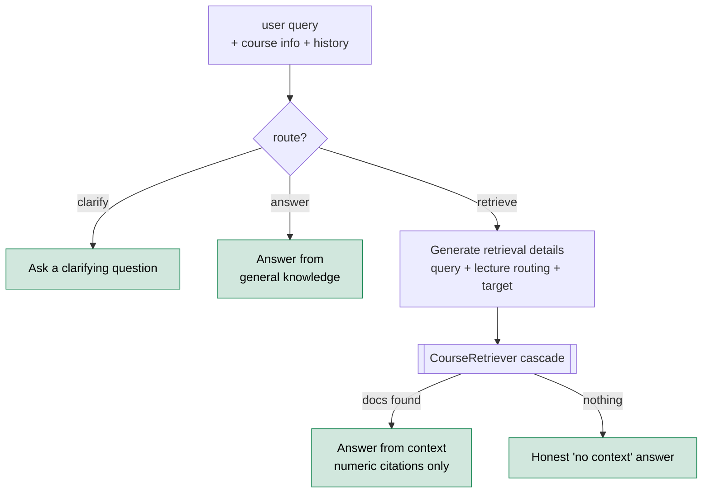
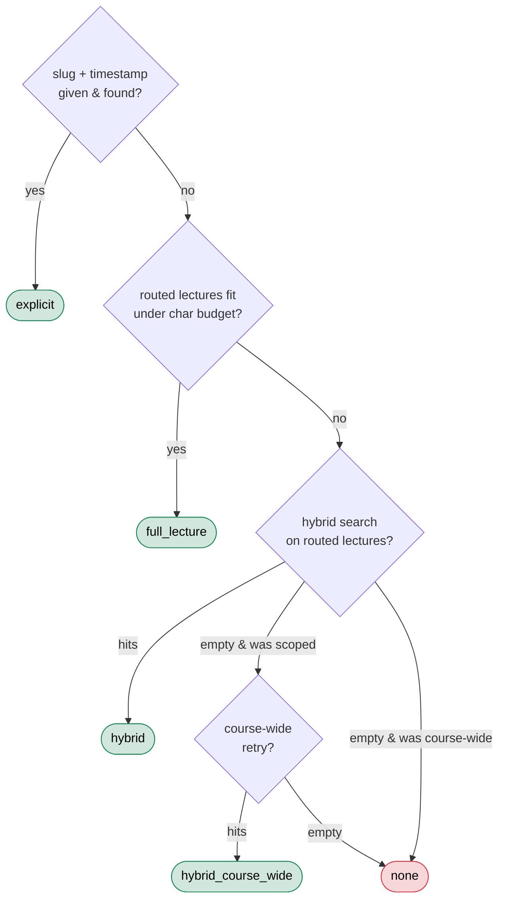
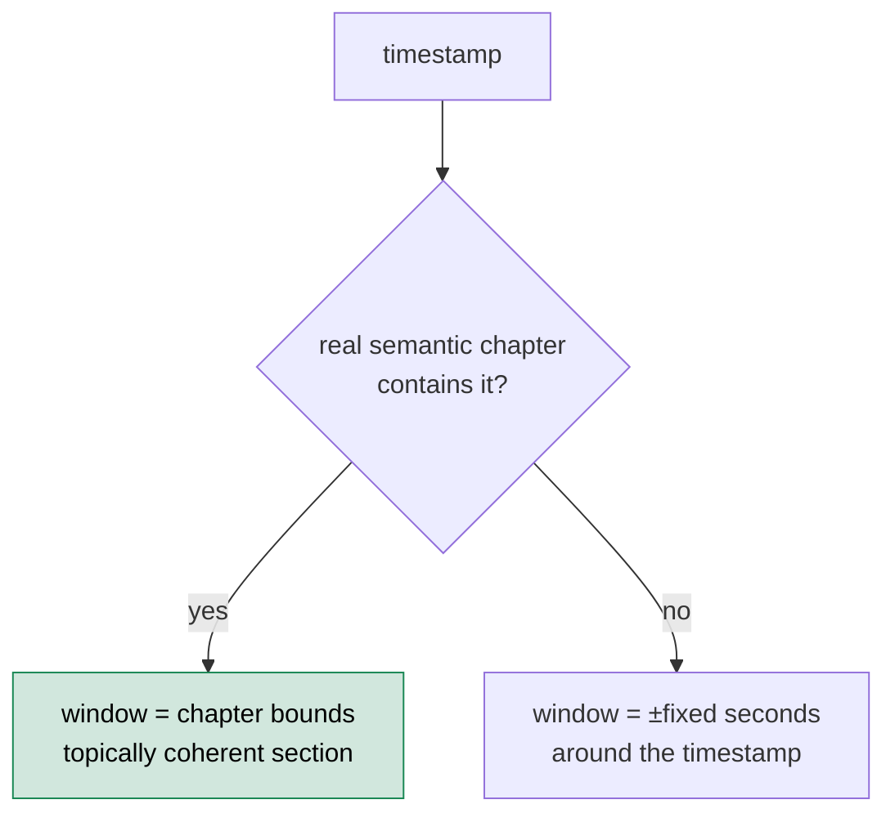
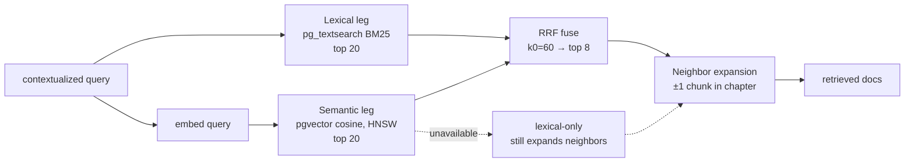
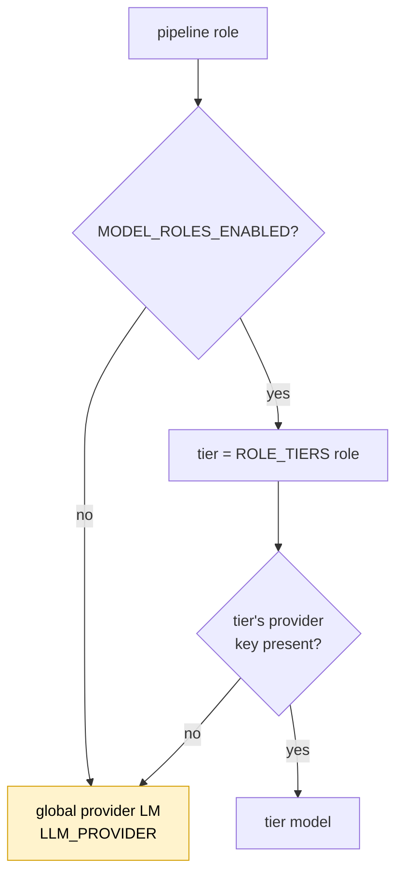

# Teaching assistant: RAG pipeline & AI orchestration

This is the **read path**: how a student's question becomes a grounded, cited answer. It consumes exactly what [`video-processing.md`](./video-processing.md) produced — the `content_chunks` corpus and `transcript_segments` — and turns it into an answer that links back to the moment in the video.

The headline design decision: **this is not retrieve-then-answer.** It's a *routed cascade* built on [DSPy](https://dspy.ai). A router first decides whether a question even needs the corpus; only the `retrieve` branch touches it, and even then a five-step retrieval cascade tries cheap, precise strategies before expensive, fuzzy ones. Each step is sized to its job — a fast model routes, the flagship writes cited answers — and every layer degrades gracefully rather than failing the turn.

> **Where the code lives:** `app/ai/teaching_assistant.py` is the orchestrator (the DSPy module + cascade). Retrieval is `app/rag/` — `course_retriever.py` (the cascade), `hybrid_retrieve.py` (BM25 + vector + RRF), `explicit_retrieve.py` (timestamp/deictic). Model tiering is `app/ai/model_roles.py` + `llm.py`. Citation post-processing is `app/services/chat_citations.py` + `app/api/v1/chat_v2.py`.

> **Scope boundary.** This doc covers *how the answer is produced*. How the answer is **streamed and rendered** (SSE events, the typewriter, citation pills, the thinking panel) is [`streaming-ux.md`](./streaming-ux.md). Table shapes are [`data.md`](./data.md).

---

## 1. The routed cascade

A chat turn runs through a DSPy module (`TeachingAssistant`) that routes first, then acts:

The router classifies into three actions:

- **`answer`** — answerable from general knowledge (definitions, "what's this course about"). No retrieval; saves latency and tokens.
- **`clarify`** — too ambiguous to answer or search. Ask one direct question and stop.
- **`retrieve`** — needs specifics from the lectures. Generate a search query, run the cascade, answer from what came back.

When the router emits anything outside this set, normalization **defaults to `retrieve`** — better to look for evidence than to guess. And if the `retrieve` branch finds nothing, it doesn't fabricate: it routes to an honest "I couldn't find that in the lectures" answer (the prompt is primed with a system note that retrieval came back empty).

### Why DSPy

Each step is a **DSPy signature** — a typed input/output contract — wrapped in a module:

| Signature | Module | Purpose |
|---|---|---|
| `RouteQuery` | `ChainOfThought` | Classify into answer / retrieve / clarify. |
| `AskClarification` | `Predict` | Produce a clarifying question. |
| `AnswerWithoutContext` | `ChainOfThought` | General-knowledge answer. |
| `GenerateRetrievalDetails` | `ChainOfThought` | Emit a self-contained query, lecture routing, and an optional jump-to target. |
| `AnswerFromContext` | `ChainOfThought` | Answer using only retrieved docs, with strict numeric citations. |

DSPy buys three things here: **separation of prompt from control flow** (re-tiering a step or swapping a retriever doesn't touch prompt text), **`ChainOfThought` reasoning** that's captured and surfaced as the "thinking" panel, and **`streamify`** for token streaming. The module is deliberately **string-in / string-out and DB-agnostic** — retrieval is injected as a `CourseRetriever`, so the whole orchestrator is unit-testable with a mock retriever and a DSPy `DummyLM`.

One subtle design choice: each signature gets a **purpose-built projection** of the course, not the whole thing. The router/clarifier get a lean catalog; query generation gets the rich lecture summaries that drive routing; `AnswerFromContext` gets only a minimal header — its content must come from the retrieved docs, and a richer course view would invite *uncited* claims. Views are rendered lazily, so a turn only pays for what its branch uses.

### Blocking and streaming, same cascade

There are two entry points that walk identical logic: `aforward` (blocking, returns a `TeachingAssistantResult`) and `astream` (yields typed events). `aforward` wraps each blocking DSPy call in `asyncio.to_thread` so the FastAPI event loop stays responsive; `astream` runs everything through `dspy.streamify`. Keeping them in lockstep (same views, same no-context fallback, same video-mode handling) means the streamed answer and the non-streamed one are never subtly different. The event mechanics of `astream` belong to [`streaming-ux.md`](./streaming-ux.md).

---

## 2. The retrieval cascade

When the router says `retrieve`, `CourseRetriever` runs a **five-step cascade**, cheapest-and-most-precise first. It returns a `RetrievalDecision(docs, path)` — the `path` label feeds analytics and the thinking panel.

| Path | When it fires | Strategy |
|---|---|---|
| `explicit` | The model resolved a `(lecture, timestamp)` target — "in L2 at 27:36…". | Deterministic window around that moment ([§3](#3-explicit--deictic-retrieval-the-chapters-payoff)). |
| `full_lecture` | One or a few routed lectures whose full transcript fits a character budget. | Feed the whole transcript — no lossy chunking when it's cheap to read it all. |
| `hybrid` | The routed lectures are too big for full-text; search within them. | BM25 + vector + RRF, scoped to those lectures ([§4](#4-hybrid-retrieval)). |
| `hybrid_course_wide` | A *scoped* hybrid search came back empty. | Retry across the whole course — rescues a confident-but-wrong lecture pick. |
| `none` | Nothing matched anywhere. | Caller switches to the honest "no context" answer. |

The `hybrid_course_wide` step is the interesting one. The model scopes its search to the lectures it thinks are relevant (so a correctly-routed lecture isn't starved by a global ranking), but if that scoped search finds nothing — the answer was in L5, not the L3 it guessed — the cascade **widens to the whole course before giving up** rather than declaring defeat. It's skipped when the routing was already empty (that search was course-wide to begin with).

---

## 3. Explicit & deictic retrieval (the chapters payoff)

Two retrievers handle "point at a moment" questions, both deterministic (no ranking):

- **`retrieve_explicitly`** — the student named a spot ("what is she explaining in L2 at 27:36?"). Loads the transcript *window* around that timestamp.
- **`retrieve_recent_window`** — video mode only. Loads the trailing ~120 seconds *before the playback head* to anchor deictic questions like "what did he just say?" / "explain that." This is additive — merged with whatever the main cascade retrieved, and able to stand alone if retrieval came back empty.

Both pick their window the same way, and **this is exactly where chapters earn their keep**:

`_find_chapter_at` deliberately **excludes the `Full Lecture` fallback** (it filters `model_id IS NOT NULL`; only real LLM-generated chapters carry a `model_id`). So today, with chapters dormant, this path *always* takes the right branch — a fixed ±60s (explicit) or 120s (recent) window. Turn `CHAPTERS_ENABLED=true` on and the same code starts returning the actual topical section the student is in, with no other change. This is the single place where enabling chapters produces a noticeable retrieval-quality difference (see the [chapters note in `data.md`](./data.md#a-note-on-chapters)).

---

## 4. Hybrid retrieval

For the `hybrid` paths, two independent legs run over `content_chunks` and get fused:

- **Lexical leg** — Postgres `pg_textsearch` BM25 over the chunk text. Always runs.
- **Semantic leg** — embed the query (OpenAI `text-embedding-3-small`, 1536-dim) and rank by pgvector cosine distance over the HNSW index. **Best-effort.**
- **RRF fusion** — [Reciprocal Rank Fusion](https://learn.microsoft.com/azure/search/hybrid-search-ranking): each leg contributes `1/(k0 + rank)` per hit (`k0=60`), summed across legs, deduped by `chunk_id`, top 8. RRF needs no score calibration between the two legs — it works purely on ranks, which is what makes mixing BM25 scores with cosine distances clean.
- **Neighbor expansion** — after fusion, pull ±1 neighboring chunk *within the same chapter* (capped at 6 extra). A hit mid-explanation gets its surrounding context without bloating chunk size. This is the chapter-scoped query path that the dormant fallback chapter keeps exercising (with one chapter, "within the chapter" means "within the lecture").

### Graceful degradation

The semantic leg is wrapped so it can *never* fail a turn — three independent off-ramps all fall back to lexical-only:

1. **No embeddings stored** for the course (a fast `EXISTS` check before any external call) → skip the leg.
2. **No embedding provider** (`OPENAI_API_KEY` unset) or a **dimension mismatch** → skip, logged once per process.
3. **Query/DB failure mid-leg** → caught, the session is rolled back (a failed query can poison the transaction), and the turn returns lexical-only.

When scoping to specific lectures, **both legs filter by `video_asset_id` in SQL before their top-k** — not post-filtered out of a global ranking, which would starve a correctly-routed lecture whose best chunks rank below others'.

`HybridRetrieveConfig` exposes the knobs: `lexical_k`/`semantic_k` (20), `top_k` (8), `rrf_k0` (60), and the neighbor window.

---

## 5. Model orchestration: one job, one tier

The pipeline talks to **three providers**, and each call site is sized to its job. A single global model would either overpay (flagship for a yes/no routing call) or underperform (a cheap model writing cited answers). `model_roles.py` maps **role → tier → (model, key)**:

| Role | Tier | Default model | Why this tier |
|---|---|---|---|
| `router` | haiku | `claude-haiku-4-5` | High-volume internal decision; fast & cheap. |
| `clarify` | haiku | `claude-haiku-4-5` | Low-stakes short question. |
| `answer_no_ctx` | haiku | `claude-haiku-4-5` | User-facing prose, but no citations to get wrong. |
| `gen_retrieval_params` | **sonnet** | `claude-sonnet-4-6` | **Correctness gate** — search quality decides everything downstream. |
| `answer_with_ctx` | **sonnet** | `claude-sonnet-4-6` | **Correctness gate** — citation accuracy. |
| `lecture_summary` | sonnet | `claude-sonnet-4-6` | Feeds retrieval context, so quality compounds. |
| `title` | haiku | `claude-haiku-4-5` | Trivial label — but *not* flash (see below). |
| `chapters` | flash | `gemini-2.5-flash` | Input-heavy (whole transcript in), cheapest capable model wins. |
| `course_summary` | flash | `gemini-2.5-flash` | Display-only, cost-sensitive. |

Two things make this robust rather than fragile:

- **Safety by construction.** If `MODEL_ROLES_ENABLED=false`, or the resolved tier's provider key is missing, `build_lm_for_role` falls back to the global provider instead of erroring. A dev box with only `GOOGLE_API_KEY` runs the *entire* pipeline on Gemini Flash — tiering only fully applies once all three keys are set. This is why a missing key never makes a request worse-configured than the single-provider baseline.
- **A documented gotcha.** `title` looks like a flash job (3–5 word label) but lives on haiku: Gemini Flash spends "thinking" tokens that count against `max_tokens`, so a tiny budget (the title's ~40) truncates to empty output. The per-role token budgets (`router` 512, answers 2048) live alongside the tier map.

Re-tiering is a one-line change (move `gen_retrieval_params` to haiku once an eval confirms quality holds), and the resolved model id per role is recorded in the turn's `debug` for observability.

---

## 6. Citations: numeric by contract, recovered if not

Grounding is only useful if citations are trustworthy, so citation handling is strict and defensive:

1. **The prompt forbids anything but numeric keys.** `AnswerFromContext` is told, in no uncertain terms: cite with `[1]`, `[2]` only; never by slug (`[L1]`), never raw timestamps, never echo the `[Source: …]` metadata, never invent a number not in the docs. Docs are rendered with 1-based numeric keys that line up with the citations array.
2. **Recovery for when models slip.** Smaller/faster models occasionally echo the lecture slug they see (`[L1]`). `_normalize_slug_citations` walks every `[...]` in the reply and rewrites a known slug to its numeric index *before* the link formatter runs (which only touches `[<digits>]`). Pure-digit and unknown brackets are left alone.
3. **Enrichment into deep links.** `_docs_to_citations` turns each retrieved doc into a `ChatCitation` carrying the lecture slug, start/end seconds, chapter id/title, and a cleaned snippet (inline `[M:SS]` markers stripped, capped at 240 chars). `attach_citation_urls` and `attach_video_chapter_titles` then add the player URL and chapter label, so the UI can render a pill that jumps to the exact second.

The result is a citation that survives the round-trip from model output to a clickable timestamp — and degrades to plain numbered references even when the model misbehaves.

---

## 7. Video-mode awareness

When the chat is opened over a playing lecture, the turn carries a `ViewingContext` (which lecture, what timestamp). Three mechanisms make the assistant *situationally aware* without jailing it to the current lecture:

- **Deictic anchor.** A one-line note — "The student is currently watching L2: Backprop at 5:30" — is prefixed to every signature's course view, so "this", "that", "what he just said" resolve to the right lecture and position.
- **Soft scoping.** `_apply_soft_scope` ensures the watched lecture is in the routing set (preferred first) *without* removing the model's other picks — and an empty routing (the model's signal for "search course-wide") is preserved, so course-wide questions asked mid-video still reach the whole course.
- **Recent-window merge.** The just-watched 120s window ([§3](#3-explicit--deictic-retrieval-the-chapters-payoff)) is merged in as citation `[1]`, with redundancy removed: if a retrieved chunk already covers the window, the anchor is dropped rather than duplicated.

All of this lives in pure helper functions shared by `aforward` and `astream`, so video behavior is identical on both paths.

