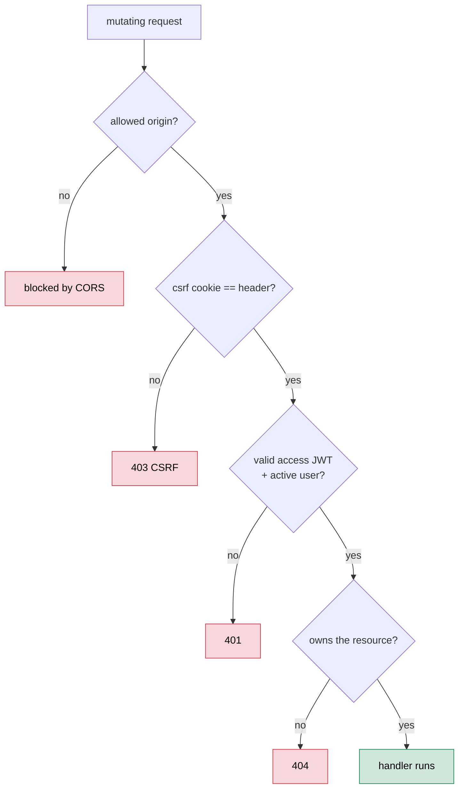
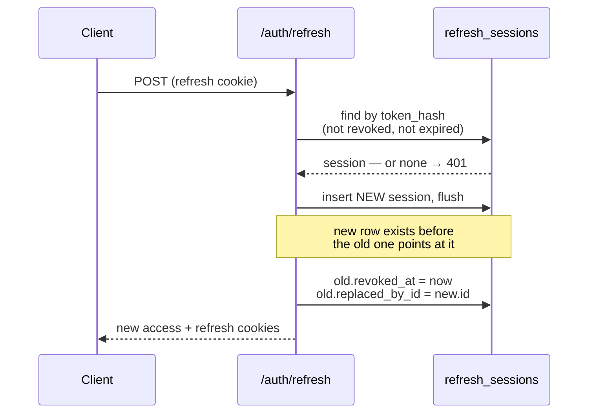

# Security

This is the **perimeter** that wraps every other layer. ClassMate uses cookie-based auth (no tokens in JavaScript-readable storage), double-submit CSRF protection, and per-resource ownership checks on every route. It's a deliberately small, conventional surface — and this doc is equally honest about what is _not_ there (no rate limiting, no MFA), so nobody mistakes the polished parts for completeness.

The model in one sentence: **a mutating request has to clear four gates — origin, CSRF, authentication, ownership — and authentication is stateless (JWT) while sessions are stateful (revocable refresh tokens).**

> **Where the code lives:** `app/core/security.py` (password hashing, JWT, token + cookie helpers), `app/api/v1/auth.py` (login/signup/refresh/logout), `app/api/deps.py` (`get_current_user`), `app/main.py` (CSRF middleware + CORS), and the `ensure_owned_course` helper in `app/services/chat_citations.py`. Config is `app/core/settings.py`.

> **Scope boundary.** The `users` and `refresh_sessions` _table shapes_ (and the rotation-chain columns) are [`data.md`](./data.md). This doc is the behavior — the protocols and where they're enforced.

---

## 1. The request gauntlet

Every unsafe (mutating) request passes through four gates before a handler runs. Each rejects with a different status, and the ordering is deliberate — cheap checks first, the DB-touching ownership check last.



The rest of this doc walks each gate.

---

## 2. Authentication: cookies + JWT

**Passwords** are hashed with **bcrypt** (`bcrypt.gensalt()` + `checkpw`, which is timing-safe by design). Signup enforces a non-empty display name (≤120 chars) and a minimum 8-character password. There is no plaintext password anywhere — only the bcrypt hash in `users.hashed_password`.

**The access token** is a JWT (HS256) carrying `sub` (user id), `exp`, and `iat`. Decoding _requires_ `exp` and `sub` to be present. Its TTL is short — **15 minutes** — because access tokens are stateless (see the [revocation caveat](#the-stateless-access-caveat)).

Auth is entirely **cookie-based** — three cookies, each with a deliberate config:

| Cookie          | HttpOnly | Path           | Purpose                                                                                                                           |
| --------------- | -------- | -------------- | --------------------------------------------------------------------------------------------------------------------------------- |
| `access_token`  | ✅       | `/`            | The JWT. JS can't read it (XSS can't exfiltrate it).                                                                              |
| `refresh_token` | ✅       | `/api/v1/auth` | The opaque refresh token, **path-scoped** so it's only ever sent to the auth routes — it never rides along on ordinary API calls. |
| `csrf_token`    | ❌       | `/`            | Readable by JS _on purpose_ — the frontend echoes it into the `X-CSRF-Token` header ([§4](#4-csrf-double-submit-cookie)).         |

All three honor `COOKIE_SECURE` and `COOKIE_SAMESITE`. `get_current_user` (the dependency on every protected route) reads the access cookie, decodes the JWT, loads the user, and rejects with `401` unless the user exists and `is_active`.

---

## 3. Refresh-token rotation

Sessions are stateful and revocable, which is what makes "log out" and "this token was stolen" meaningful. Two design choices stand out:

- **The raw token is never stored.** The cookie holds an opaque random string (`secrets.token_urlsafe(32)`); the database stores only its **HMAC-SHA256 keyed hash**. A database leak yields hashes that can't be replayed without the secret.
- **Every refresh rotates** — the old session is revoked and a brand-new one issued, with the old one pointing at its successor (`replaced_by_id`), forming an auditable chain.



The new session is **flushed before** the old one is revoked, so the chain is never left dangling. Lookups filter on `revoked_at IS NULL AND expires_at > now` (refresh TTL is 14 days), and the user's `is_active` flag is re-checked on every refresh. **Logout** revokes the current session by hash and clears all cookies.

### The stateless-access caveat

Because the access token is a stateless JWT, **revoking a session does not instantly kill an already-issued access token** — it stays valid until it expires. Logout clears the cookies and revokes the refresh session, so the browser stops sending the access token and can't mint a new one; but a _stolen_ access token remains usable for up to its 15-minute TTL. The short TTL is the mitigation. This is the standard stateless-JWT trade-off, called out here so it's a known property, not a surprise.

---

## 4. CSRF: double-submit cookie

Because auth rides on cookies (sent automatically by the browser), the app needs CSRF protection. It uses the **double-submit** pattern, enforced by one middleware in `main.py`:

1. `GET /api/v1/auth/csrf` issues a random token in a **JS-readable** cookie.
2. The frontend reads it and sends it back as the `X-CSRF-Token` header on every unsafe request.
3. The middleware, for `POST/PUT/PATCH/DELETE`, requires the cookie and header to **both be present and equal** — otherwise `403`.

An attacker's cross-site form can _cause_ the cookie to be sent, but can't _read_ it to populate the matching header (same-origin policy), so the two won't match. A small allowlist exempts `GET /health`, `GET /health/db`, and the CSRF-issuing route itself. The whole thing is toggleable via `CSRF_ENABLED`.

---

## 5. Authorization: ownership by SQL

Authentication proves _who_ you are; authorization proves you own _this_ resource. Every course/lecture/conversation route enforces ownership, and the pattern is uniform — a `WHERE ... AND user_id = :me` filter, centralized in `ensure_owned_course`:

```python
res = await db.execute(select(Course).where(Course.id == course_id, Course.user_id == user_id))
course = res.scalar_one_or_none()
if course is None:
    raise HTTPException(status_code=404, detail="Course not found")
```

Two things to notice:

- **404, not 403.** A resource you don't own is reported as _not found_, not _forbidden_ — so the API never confirms that someone else's course id exists. No existence leak.
- **Nested resources join up to the owner.** A video asset or conversation is checked by joining back to `courses` and filtering on `user_id`, so ownership is always rooted at the authenticated user. (`video_assets.py` alone has 11 such checks.)

### S3 key scoping

Direct-to-S3 uploads get the same treatment. The presigned key is namespaced `users/{user_id}/courses/{course_id}/…`, and at finalize the backend **re-checks the `users/{current_user.id}/` prefix** — so a user can't finalize against an S3 key that isn't under their own namespace (`400` if it isn't). Ownership is enforced both when the key is minted and when it's redeemed.

---

## 6. Configuration & secrets

- **`JWT_SECRET`** is the single most important secret — it signs access JWTs _and_ keys the refresh-token HMAC. It defaults to `dev-change-me` and **must** be overridden in production.
- **Cookie policy is validated at boot.** Settings refuse to start if `SameSite=None` is set without `Secure=true` (browsers reject such cookies), for both the auth and CSRF cookies — a fail-fast guard against a silently-broken login.
- **CORS is explicit.** `allow_credentials=True` (required so the browser sends cookies cross-origin) means **no wildcard origin is possible** — `CORS_ORIGINS` must list exact origins, and `X-CSRF-Token` is in the allowed headers.

**Production checklist:** set a strong `JWT_SECRET`; `COOKIE_SECURE=true`; an appropriate `COOKIE_SAMESITE`; exact `CORS_ORIGINS`; and keep hosts consistent (don't mix `localhost` and `127.0.0.1`, or cookies won't line up).
