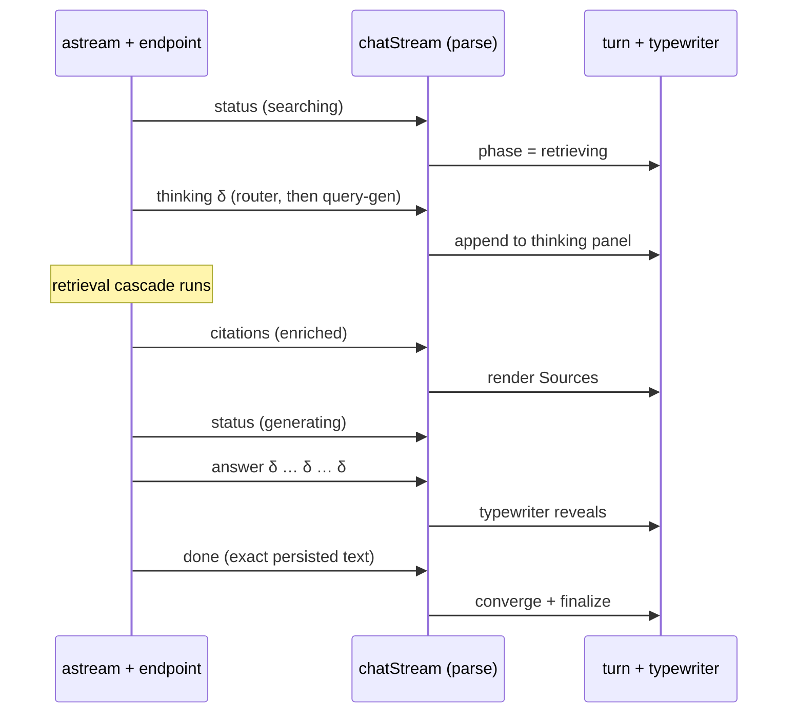
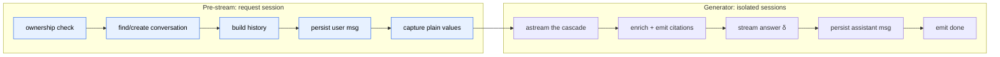
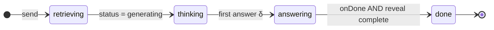
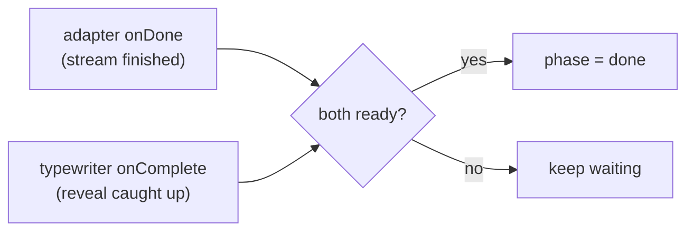
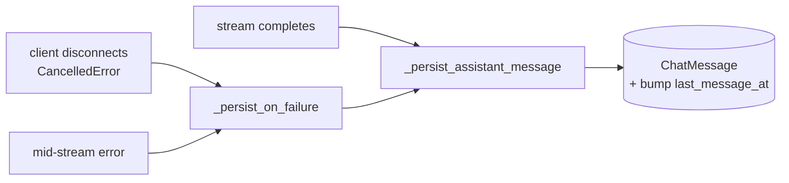

# Streaming UX

This is the **delivery layer**: how the grounded answer that [`rag-and-ai.md`](./rag-and-ai.md) produces actually reaches the screen — token by token, sources first, with a thinking panel that fills as the model reasons. It spans the backend SSE producer and the frontend consumer as one contract.

The design goal is **progressive disclosure with no waterfalls**. A student shouldn't stare at a spinner: they see "Searching…", then the model's reasoning streaming in, then the cited sources appear, then the answer types out — each as soon as it's ready, never blocking on the next. And when the turn finishes, the live, hand-streamed message has to converge _exactly_ onto the persisted one so a background refetch doesn't make the text flicker.

> **Where the code lives:** backend `app/api/v1/chat_v2.py` (the `/chat-v2/stream` endpoint) + `app/ai/stream_events.py` (the typed events). Frontend `src/api/chatStream.js` (SSE parsing), `src/hooks/useAssistantTurn.js` (turn state machine), `src/components/chat/useTypewriter.js` (reveal), and `citations.js` / `CitationPopover.jsx` (pills & deep links).

> **Scope boundary.** This doc is about _transport and rendering_. What the events **mean** — why the router chose `retrieve`, how hybrid retrieval works — is [`rag-and-ai.md`](./rag-and-ai.md). The `chat_*` table shapes are [`data.md`](./data.md).

---

## 1. The event lifecycle

The cascade (`TeachingAssistant.astream`) yields five typed events. The endpoint serializes each as an SSE `data:` frame; the frontend maps them 1:1 onto handlers. The **ordering is a contract**, and the key guarantee is that **citations arrive before any answer token** — so the UI can paint "Sources" while the answer is still streaming.



| Event            | Wire `type` | Carries                                     | Frontend effect                                 |
| ---------------- | ----------- | ------------------------------------------- | ----------------------------------------------- |
| `StatusEvent`    | `status`    | `searching` / `generating`                  | Drives the phase + status label.                |
| `ThinkingEvent`  | `thinking`  | a chunk of reasoning                        | Appended to the thinking panel (live only).     |
| `CitationsEvent` | `citations` | enriched `ChatCitation[]`                   | Renders the Sources before the answer.          |
| `AnswerEvent`    | `answer`    | a chunk of answer text (raw `[N]` markers)  | Fed to the typewriter.                          |
| `DoneEvent`      | `done`      | the exact persisted text + `conversationId` | Converges the live turn onto the saved message. |

On the `answer` / `clarify` routes there's no retrieval, so the stream is shorter: router thinking → the reply streams → `done`. An `error` frame can replace `done` if the turn fails mid-stream ([§8](#8-persistence--the-livepersisted-handoff)).

---

## 2. Backend: producing the stream

The endpoint has a deliberate **two-phase split**, because a `StreamingResponse` can't raise a clean HTTP error once bytes start flowing.



**Pre-stream** runs on the request's DB session and does everything that might need to fail loudly: ownership (`404` if not owned), conversation lookup/create, history build, persisting the user's message, optional title generation. Any `HTTPException` here surfaces as ordinary JSON, _before_ the stream opens. Then it **captures plain values** — the request session and its ORM objects are unusable once the `StreamingResponse` is returned.

**The generator** runs on fresh, isolated sessions. Three details matter:

- **Citations are enriched on their own session and emitted before the answer.** When `astream` yields the `CitationsEvent`, the endpoint converts docs to `ChatCitation`s and runs `attach_citation_urls` + `attach_video_chapter_titles` (adding the player URL and chapter label) on a separate session, then sends the `citations` frame. `astream` guarantees this fires before any `answer` delta.
- **`done` is emitted only after persistence.** The terminal frame isn't a pass-through of `DoneEvent` — the endpoint first writes the assistant message on a fresh write session, then sends `done` carrying the **exact persisted text** (so the client can converge to it). The answer is accumulated into `answer_parts` along the way purely as a persistence safety net.
- **Thinking streams but is never accumulated or persisted.** It's a live-only affordance.

The response sets `X-Accel-Buffering: no` and `Cache-Control: no-cache` so proxies (nginx) don't buffer the stream into one blob.

---

## 3. Frontend: consuming the stream

`chatStream.js` is the single adapter everything else talks to. The default path is a real SSE reader; a `VITE_CHAT_STREAMING=false` fallback hits the blocking endpoint and synthesizes the same handler calls, so the UI code is identical either way.

The SSE parse is a hand-rolled frame splitter over `fetch`'s `ReadableStream`:

```js
buffer += decoder.decode(value, { stream: true });
while ((idx = buffer.indexOf("\n\n")) >= 0) {
  const block = buffer.slice(0, idx).trim(); // one "data: {…}" frame
  buffer = buffer.slice(idx + 2);
  if (block.startsWith("data:")) dispatch(JSON.parse(block.slice(5).trim()));
}
```

`dispatch` routes each frame to a handler (`onStatus` / `onThinkingDelta` / `onCitations` / `onAnswerDelta` / `onDone` / `onError`). Cancellation is an `AbortController.abort()`. Pre-stream guard errors (the `res.ok === false` case) are read as JSON and re-thrown with `.status` / `.data`, so they're indistinguishable from a normal API error to the caller.

---

## 4. The turn state machine

`useAssistantTurn` owns one live turn and walks it through four phases. The event handlers map onto phase transitions:



`onStatus(generating)` moves `retrieving → thinking`; the first `onAnswerDelta` moves `thinking → answering`; `onError` from any phase clears the turn entirely. The `viewing` context (which lecture + the live playback head) is read **at send time** via `getViewing()`, so the timestamp reflects exactly where the video was when the student hit enter.

---

## 5. Dual finalization — the subtle bit

The turn does **not** reach `done` when the network says so. It reaches `done` only when **both** of these are true:



`finalizeIfReady()` gates on `doneInfoRef` (the stream finished) **and** `revealDoneRef` (the typewriter has revealed all the text). Why both? The answer streams faster than it's typed out. The moment the stream ends, React Query may refetch the conversation and try to swap the live turn for the persisted message — if that happened mid-reveal, the half-typed text would **snap to full instantly**, an ugly flicker. Gating on the typewriter too means the swap waits for the animation to finish. This is the one piece of state coordination that makes the whole thing feel smooth.

---

## 6. The typewriter

`useTypewriter` reveals a _growing_ string at ~150 chars/sec, on a `requestAnimationFrame` loop with a per-frame character budget. Three refinements make it feel right:

- **Sentence cadence.** A 160ms hold after `.`, `!`, `?` gives the reveal a natural rhythm instead of a flat crawl.
- **Atomic citation markers.** Citation links (`[1](#cm-cite-1)`) are precomputed as spans; when the cursor enters one, it jumps to the span's end. A half-typed `[1](#cm-ci` link syntax never renders — markers pop in whole.
- **Accessibility.** `prefers-reduced-motion` short-circuits to an instant, full reveal (and still fires `onComplete`, so finalization isn't blocked).

It returns `visibleText` (the revealed slice) and `done`; the latter is what feeds `revealDoneRef` in [§5](#5-dual-finalization--the-subtle-bit).

---

## 7. Citations → deep links

Answer text streams with **raw `[N]` markers**; the UI normalizes them into clickable links. `normalizeCitationMarkers` is idempotent and does four passes:

1. Rewrite persisted `[..](#cm-src-N)` links to the canonical `[N](#cm-cite-N)`.
2. Turn plain `[N]` into a link **only when citation N exists** (a guard skips `arr[0]` and reference-style `[x][1]`).
3. Move a marker that sits _before_ sentence punctuation to _after_ it — chips cite the sentence they follow.
4. Merge whitespace-adjacent markers into one multi-source chip `[N](#cm-cite-N-M-…)`, deduping exact-duplicate moments.

Each pill opens a popover. On the video player page, a timestamp for the **currently-playing lecture seeks in place** (via an `onSeek` callback when the citation's `contentId` matches the lecture on screen); anywhere else it opens the player in a new tab. The chapter label is shown _unless_ it's redundant — which, with [chapters dormant](./data.md#a-note-on-chapters), means the `"Full Lecture"` fallback is suppressed, so today pills show a timestamp without a chapter name.

---

## 8. Persistence & the live→persisted handoff

**Thinking is live-only.** The saved `ChatMessage` has `thinking = NULL`, so reloading history shows the answer and its citations but no reasoning panel (a "Thought for N s" line can still render). The thought process is an in-the-moment affordance, not a stored artifact.

**Every exit persists.** A turn is written exactly once, through `_persist_assistant_message`, on whichever of three paths it takes:



On a clean finish the full answer is saved. On a disconnect (`CancelledError`) or a mid-stream exception, `_persist_on_failure` saves whatever answer accumulated (or a fallback message) so the turn is never left dangling — and it swallows its own errors so it can't mask the original failure. Persisting normalizes slug citations and formats the inline links, then stores that exact `reply_with_links` text.

**The handoff.** The `done` frame returns that exact persisted text, and `useAssistantTurn` converges the live (raw-streamed) answer onto it via `normalizeCitationMarkers`. So when React Query later refetches the conversation, the persisted message is byte-identical to what's on screen — the dedup matches and nothing flickers.

---

## 9. Viewing context capture

Video chat is "situationally aware" because the player sends _what's on screen_ with each turn. The capture is on the frontend (`getViewing()` at send time → `watchingVideoAssetId` + `watchingTimestampSec`); the resolve is on the backend (`_resolve_viewing_context`), which **degrades gracefully** — a missing, foreign, or not-yet-transcribed asset quietly returns `None` (ordinary course chat) rather than failing the turn. What the cascade _does_ with that context (deictic anchoring, soft scoping, the recent-window merge) is [`rag-and-ai.md` §7](./rag-and-ai.md#7-video-mode-awareness).
