# UI walkthrough

A screen-by-screen tour of the ClassMate frontend (Vite + React SPA, TailwindCSS + shadcn/ui). The whole app uses a dark theme with a purple→blue gradient as the brand accent — it shows up in the logo mark, primary buttons, page-title gradients, and active-state highlights.

The tour follows a student's path through the app: sign in → pick a course → browse lectures → watch a video → ask ClassMate questions.

For how the chat answers are actually produced and streamed, see [`rag-and-ai.md`](./rag-and-ai.md) and [`streaming-ux.md`](./streaming-ux.md).

---

## 1. Authentication

### Login (`/login`)

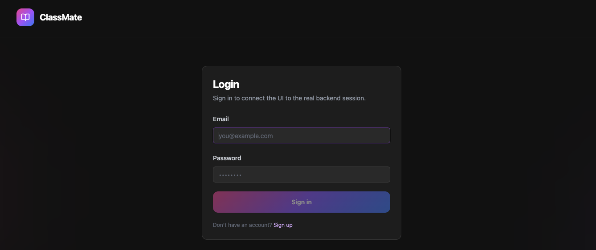

A single centered card on the dark background: email + password fields, a gradient **Sign in** button, and a link to sign up. The top bar shows only the ClassMate logo — no user chip until you're authenticated. On success the backend sets the auth cookies and the SPA redirects into the app (see [`security.md`](./security.md) for the cookie/CSRF model).

### Sign up (`/signup`)

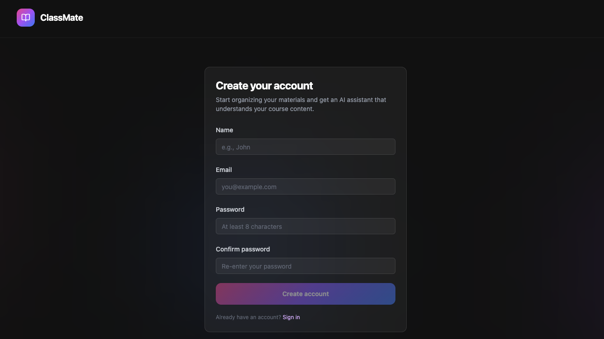

Same card layout with name, email, password, and confirm-password fields (minimum 8 characters, enforced inline). Each auth page cross-links to the other.

---

## 2. Home (`/` or `/Home`)

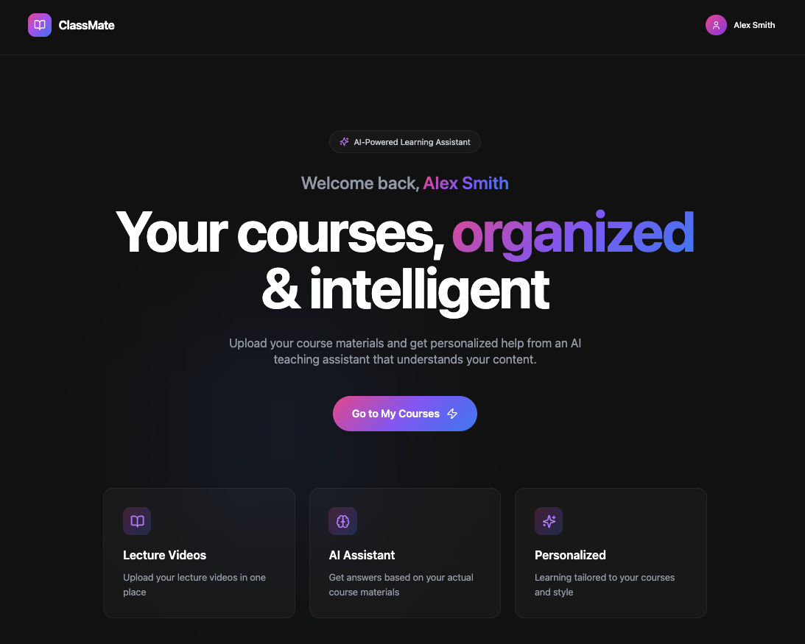

The landing page after login is a hero screen, personalized with the user's name ("Welcome back, **Alex Smith**"). The headline — "Your courses, **organized** & intelligent" — uses the brand gradient on the keyword, with a one-line pitch underneath and a single gradient CTA: **Go to My Courses**.

Below the fold, three feature cards summarize the product: **Lecture Videos** (upload in one place), **AI Assistant** (answers based on your actual course materials), and **Personalized** (tailored to your courses and style).

The persistent top bar — logo on the left, user avatar chip on the right — appears on every authenticated page.

---

## 3. My Courses (`/Courses`)

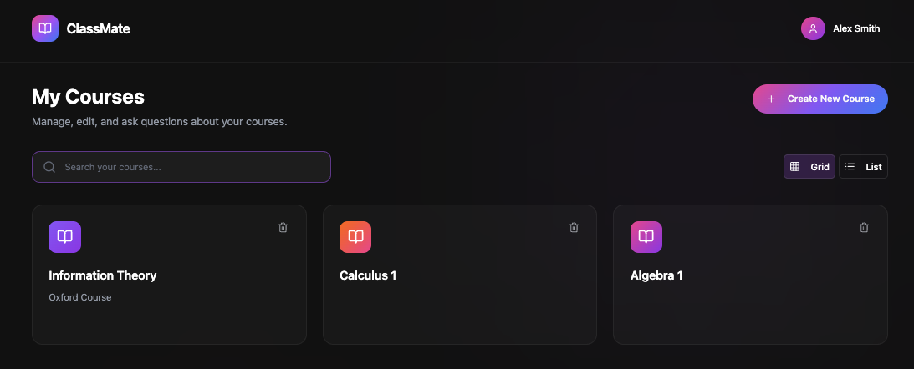

The course dashboard:

- **Header row** — page title + subtitle on the left, gradient **+ Create New Course** button on the right.
- **Search bar** — filters courses by name.
- **Grid / List toggle** — two view modes for the course collection.
- **Course cards** — each card gets a book icon in a per-course accent color, the course name, and an optional subtitle (e.g. "Oxford Course"). A trash icon in the corner deletes the course (with its lectures, via the cascade rules in [`data.md`](./data.md)).

Clicking a card opens the course overview.

---

## 4. Course overview (`/CourseOverview`)

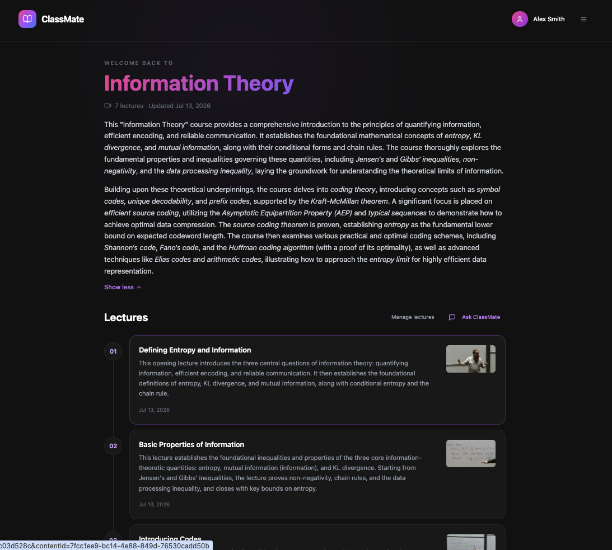

The course's front page:

- **Header** — "WELCOME BACK TO" eyebrow, the course name in large gradient type, and a meta line (lecture count · last-updated date).
- **AI-generated course description** — a multi-paragraph summary of the whole course, synthesized from the lecture summaries (see [`rag-and-ai.md`](./rag-and-ai.md)). Key terms are italicized, and a **Show less / Show more** toggle collapses it.
- **Lectures timeline** — a numbered vertical list (01, 02, …) where each card has the lecture title, a short AI-generated abstract, the upload date, and a thumbnail from the video. Clicking a card opens the video player.
- **Action row** — **Manage lectures** (jumps to Lecture Videos) and **Ask ClassMate** (opens the course-level chat).

### Course navigation sidebar

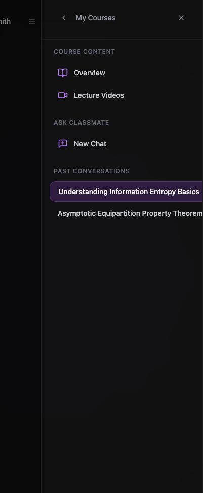

A hamburger button in the top bar opens a slide-in sidebar scoped to the current course. It has three sections: **Course content** (Overview, Lecture Videos), **Ask ClassMate** (New Chat), and **Past conversations** — the list of previous chats for this course, each with an auto-generated title; the active one is highlighted in purple. A back arrow at the top returns to My Courses.

---

## 5. Lecture Videos (`/CourseContent`)

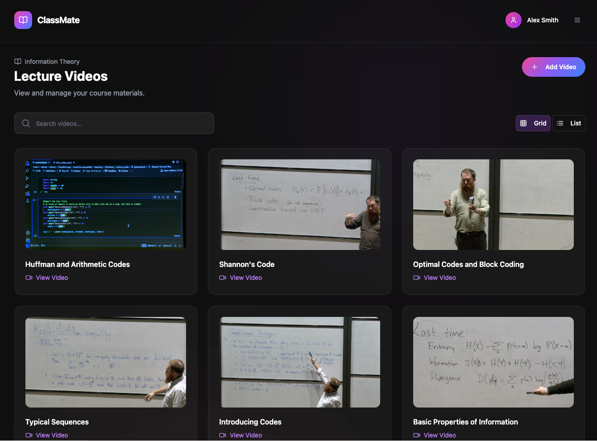

The course's material manager. Same layout grammar as My Courses — search bar, Grid/List toggle, gradient **+ Add Video** action button — but the cards are video-first: a large real thumbnail extracted from the lecture, the lecture title, and a **View Video** link.

**Add Video** starts the upload flow (direct-to-S3 presigned upload, then the transcription pipeline — see [`video-processing.md`](./video-processing.md)).

---

## 6. Video player (`/VideoPlayer`)

### ClassMate's Notes

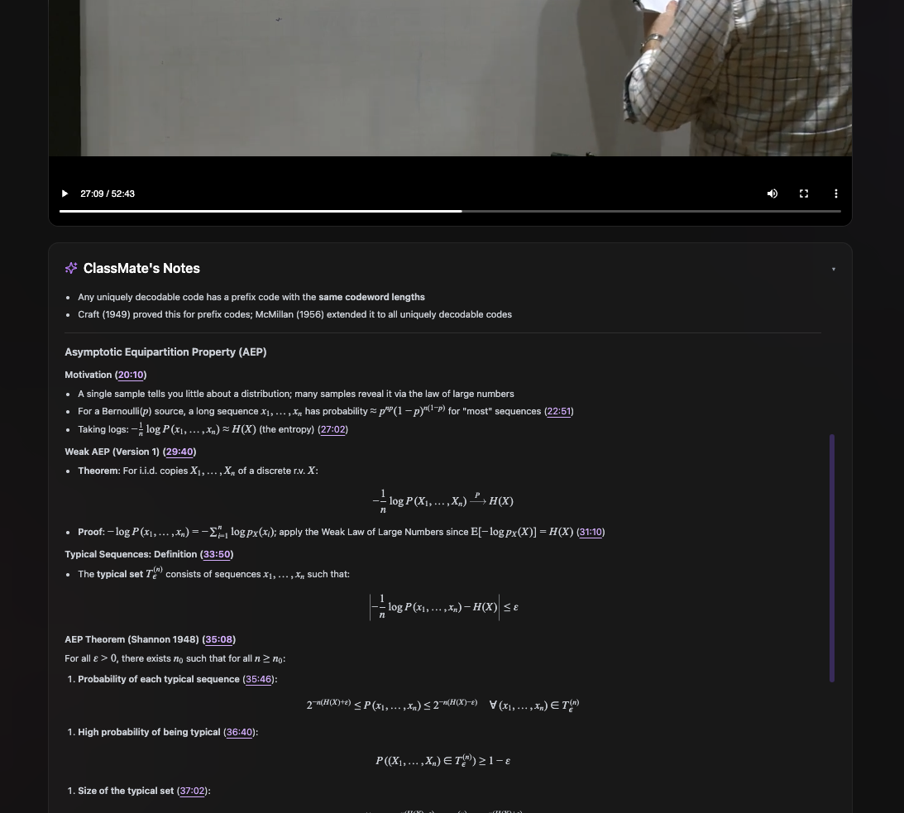

Below the player, a collapsible **✦ ClassMate's Notes** card holds AI-generated lecture notes: structured section headings, bullet points, and full LaTeX-rendered math (KaTeX). Every section and key claim carries an inline **timestamp link** (e.g. `29:40`) — clicking one seeks the video to that moment.

### Transcript panel

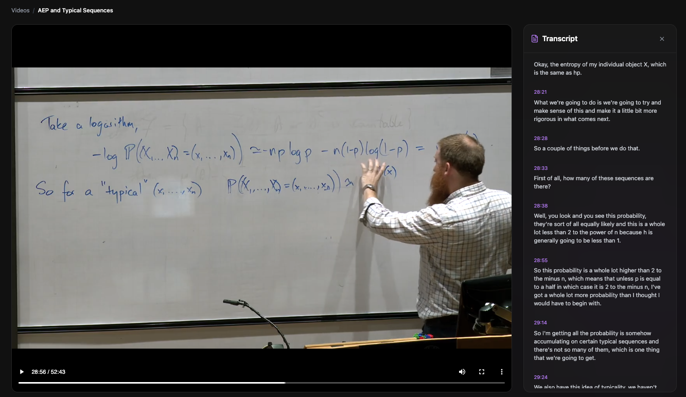

The right-hand panel can show the full **Transcript**: timestamped segments of what was said, scrollable and synced to the lecture. Each timestamp is clickable to jump the player.

### Chat panel

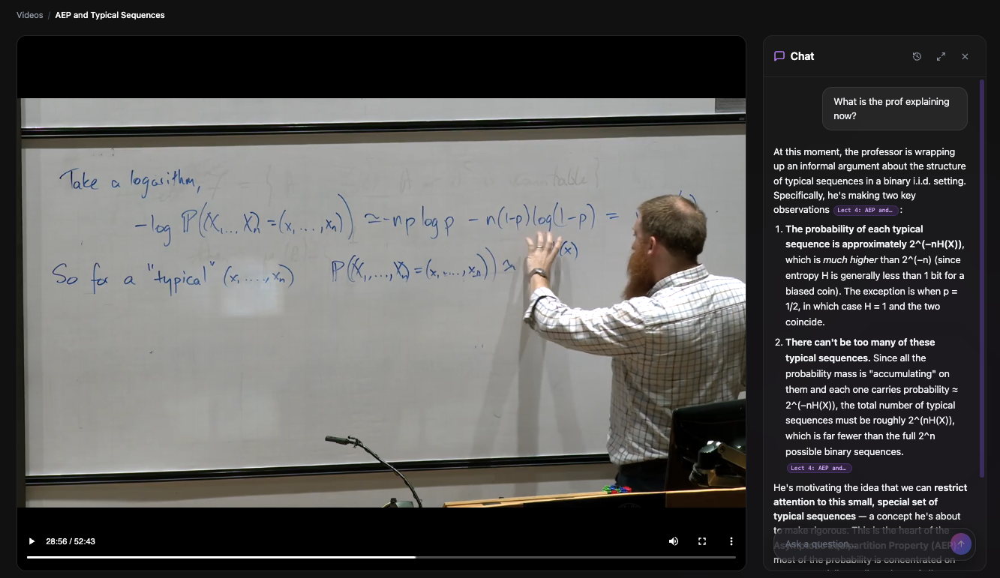

The same panel hosts **Chat** — a conversation with ClassMate scoped to this lecture. Because the assistant is video-aware, time-sensitive questions work: asking "What is the prof explaining now?" gets an answer about the exact point in the lecture you're paused at. Answers are markdown with bold key claims and inline **citation pills** (e.g. `Lect 4: AEP and…`) marking which lecture each claim comes from. The panel header has history, expand, and close buttons; a floating "Ask a question…" input sits at the bottom.

### Expanded chat

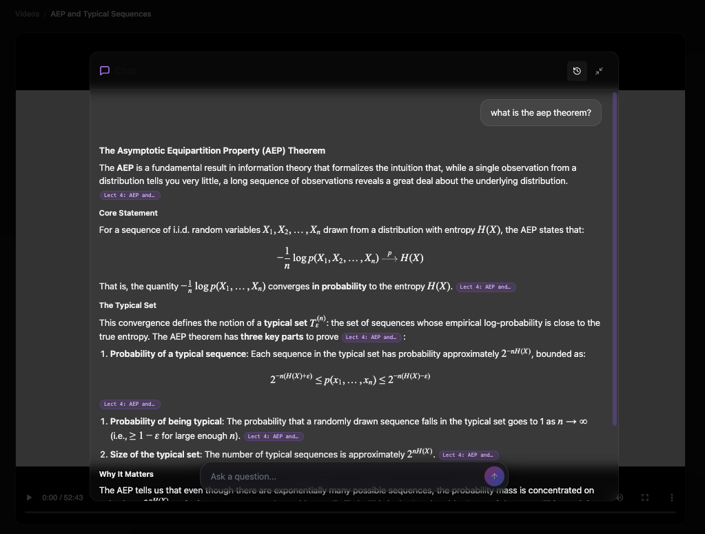

The expand button grows the chat into a large overlay centered over the dimmed player — the reading mode for long, math-heavy answers. Full theorem statements render with display-mode LaTeX, numbered lists, and section headings, with citation pills throughout. The collapse button returns it to the side panel.

---

## 7. Course chat (`/CourseChat`)

Ask ClassMate opens a full-page chat scoped to the _whole course_ (all lectures), reachable from the course overview or the sidebar's **New Chat**.

### Thinking + course-wide answers

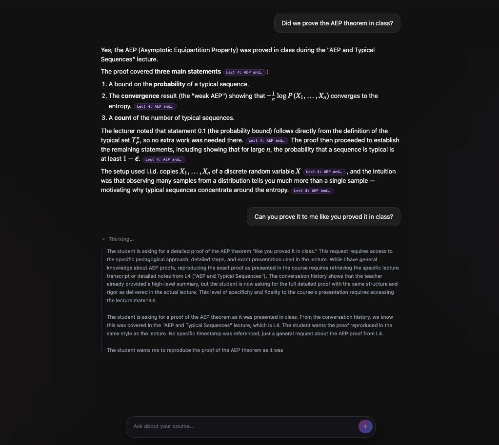

User messages appear as right-aligned bubbles; answers stream in as left-aligned markdown. Questions like "Did we prove the AEP theorem in class?" are answered _from the lectures_ — the assistant says which lecture covered it and cites it. While the pipeline works, a collapsible **Thinking…** block streams the model's reasoning live (the `thinking` phase of the SSE contract in [`streaming-ux.md`](./streaming-ux.md)), so the wait is never a blank screen.

### Citations: pills → popover → the exact moment

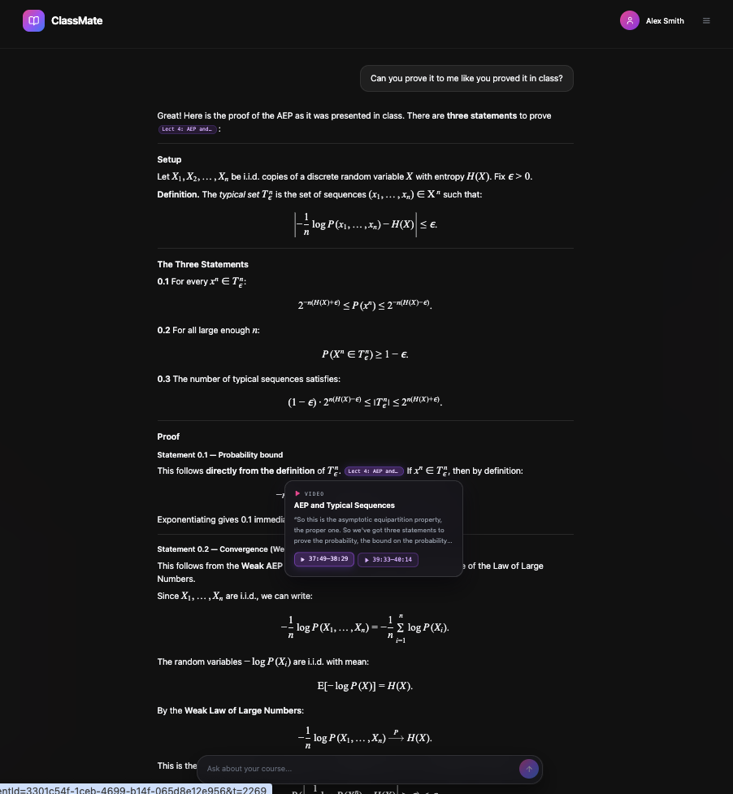

Citations are the signature interaction. Every grounded claim carries a small inline **pill** naming its source lecture. Hovering a pill opens a **popover** with a `▶ VIDEO` badge, the lecture title, a quote from the transcript at that spot, and **timestamp-range chips** (e.g. `37:49–38:29`). Clicking a chip deep-links into the video player at that exact moment — the answer is verifiable against what was actually said in class.
