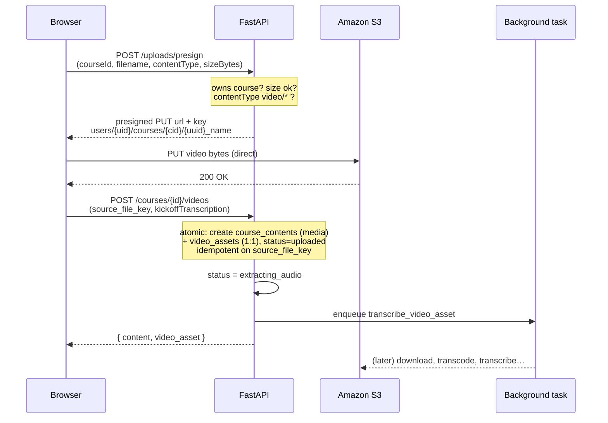
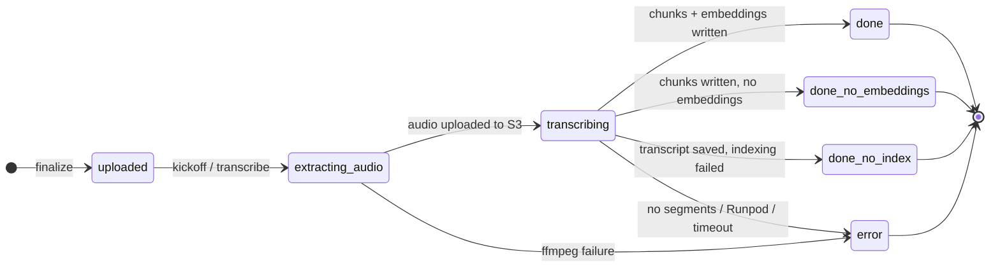
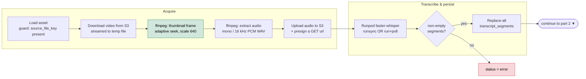
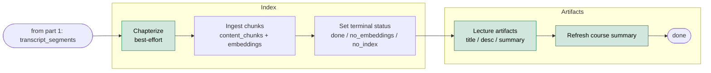
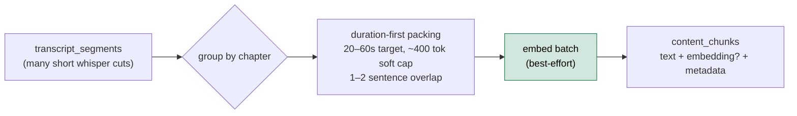
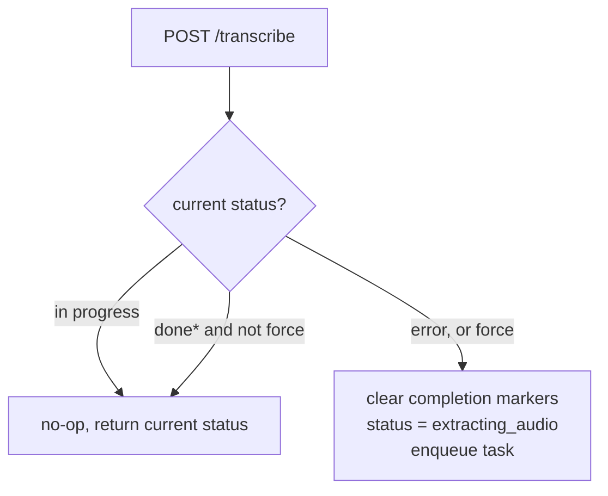

# Video processing

This is the **write path**: how a raw lecture video becomes a transcribed, chaptered, summarized, and _searchable_ asset. It's the half of the system that runs before anyone asks a question — the [RAG pipeline](./rag-and-ai.md) is the read path that consumes what this produces.

The whole thing is built around one principle: **the upload is cheap and synchronous; everything expensive is a single best-effort background task that records what it managed to finish.** A lecture is never "all or nothing" — a transcript that couldn't be embedded is still worth playing back and searching lexically, and the schema records exactly how far each lecture got.

For the tables this writes to (`video_assets`, `transcript_segments`, `video_chapters`, `content_chunks`), see [`data.md`](./data.md). This doc covers the _behavior_: the stages, the status machine, and the design decisions.

> **Where the code lives:** `app/api/v1/uploads.py` (presign), `app/api/v1/video_assets.py` (finalize + transcribe endpoints), and `app/services/transcription.py` (the background task). Chunking is `app/services/transcript_chunk_ingestion.py`; chapters `app/services/video_chapters.py`; AI artifacts `app/services/lecture_artifacts.py` + `course_summary.py`.

---

## 1. The upload handshake

The API **never proxies video bytes**. The browser uploads straight to S3 through a presigned `PUT`, and only then tells the backend "it's there." This keeps large uploads off the application server entirely.

Three things are enforced at the door, before a presigned URL is ever issued (`uploads.py`):

- **Ownership** — the requesting user must own the target course (else `404`).
- **Size** — `sizeBytes` must be within `UPLOAD_MAX_SIZE_BYTES` (1 GiB default). The frontend hint is advisory; this is the real limit.
- **Video-only** — `contentType` must start with `video/`. This is the first of three layers (presign → API validation → DB CHECK) that keep the corpus video-only.

The S3 key is namespaced `users/{user_id}/courses/{course_id}/{uuid}_{filename}` — user-scoped so a later finalize can't reference someone else's object (the finalize path re-checks the `users/{id}/` prefix).

**Finalize** (`POST /courses/{id}/videos`) is one atomic step that creates the canonical `course_contents` row (`category=media`) and its 1:1 `video_assets` partner. It's **idempotent on `source_file_key`**: finalizing the same upload twice returns the existing asset rather than creating a duplicate (backed by the `(course_id, source_file_key)` unique key). If `kickoffTranscription` is set, the handler flips `status` to `extracting_audio` _before_ returning — so the UI shows progress immediately — and enqueues the background task.

---

## 2. The status lifecycle

Everything downstream keys off `video_assets.status`. This is the single source of truth for "where is this lecture?" — there's no separate job table. The terminal states are the heart of the design: the pipeline records **what succeeded**, not just pass/fail.

The three `done_*` states are all terminal "successes" — each is searchable to some degree (see the table below). A `force` re-run sends any terminal state back to `extracting_audio`; that path is shown in [§5](#5-resumability--idempotency) rather than tangled in here.

| Status                   | Meaning                                                     | What still works                                   |
| ------------------------ | ----------------------------------------------------------- | -------------------------------------------------- |
| `uploaded`               | Finalized, not yet processing.                              | Playback once bytes are in S3.                     |
| `extracting_audio`       | Downloading + transcoding to WAV.                           | — (in flight)                                      |
| `transcribing`           | Audio handed to Runpod faster-whisper.                      | — (in flight)                                      |
| **`done`**               | Chunked **and** embedded.                                   | Full hybrid retrieval (lexical + vector).          |
| **`done_no_embeddings`** | Chunked, embeddings unavailable (e.g. no `OPENAI_API_KEY`). | Lexical/BM25 retrieval + playback.                 |
| **`done_no_index`**      | Transcript saved, chunk ingestion failed.                   | Playback + explicit "jump to timestamp" retrieval. |
| `error`                  | Hard failure _before_ transcript segments existed.          | Nothing new; previous run's data (if any) stays.   |

The distinction between the three `done_*` states is deliberate. The pipeline degrades one capability at a time rather than collapsing to a single failure — a course with no embedding key isn't broken, it's lexical-only. The UI can read `status` and set expectations honestly. (How each state behaves at query time is the [RAG doc](./rag-and-ai.md)'s job.)

---

## 3. Inside the background task

`transcribe_video_asset` is the whole pipeline in one function. It advances `status` as it goes and writes to its **own** database session (it runs after the HTTP response is already sent).

**Part 1 — acquire audio, then transcribe & persist:**

**Part 2 — index for retrieval, then generate artifacts:**

Green stages are **best-effort** — they're wrapped in `try/except` and can never fail the pipeline. Red is the only kind of fatal: a hard failure before a transcript exists.

| Stage          | What happens                                                                                                                                  | Failure mode                                       |
| -------------- | --------------------------------------------------------------------------------------------------------------------------------------------- | -------------------------------------------------- |
| Download       | Streams the S3 object to a temp file (never loads the whole video into memory).                                                               | Missing key → `error`.                             |
| Thumbnail      | One ffmpeg frame for the library UI. Seek point adapts — longer videos seek further in to skip black intro frames (`ffprobe` reads duration). | Best-effort; skipped on failure.                   |
| Audio          | ffmpeg normalizes to mono / 16 kHz PCM WAV — the format faster-whisper wants.                                                                 | ffmpeg failure → `error` ("ffmpeg failed").        |
| Upload audio   | WAV goes back to S3 and is presigned, because Runpod fetches it over HTTPS (it can't reach your S3 credentials).                              | Exception → `error`.                               |
| Transcribe     | Runpod serverless faster-whisper. Output parsed into timestamped segments.                                                                    | Job failure / timeout / **no segments** → `error`. |
| Persist        | **Replace-all** for `(video_asset_id, language_code)` — re-running is safe.                                                                   | —                                                  |
| Chapters       | Best-effort; see [below](#chapters-dormant-but-wired).                                                                                        | Never fails the pipeline.                          |
| Ingest         | Chunk + embed into `content_chunks`; decides the terminal `done_*` status.                                                                    | Failure → `done_no_index` (transcript survives).   |
| Artifacts      | AI title / description / summary, only if missing.                                                                                            | Best-effort.                                       |
| Course summary | Re-roll the course-level summary now a new lecture exists.                                                                                    | Best-effort.                                       |

### The Runpod call: two modes

faster-whisper runs on Runpod serverless, called one of two ways (`RUNPOD_USE_RUNSYNC`, default on):

- **`runsync`** — a single HTTP call blocks for the entire job. Simple, but the HTTP timeout must cover the whole transcription budget (`RUNPOD_TIMEOUT_SECONDS`, 1800s).
- **`run` + poll** — the submit call returns a job id immediately, then `poll_until_complete` checks `/status/{id}` every `RUNPOD_POLL_INTERVAL_SECONDS` until done or the budget expires.

The client parses tolerantly (accepting `start`/`start_sec`, `output`/`result`, several "success" spellings) so minor worker-schema drift doesn't break ingestion. The one hard contract: **non-empty timestamped segments**, or it's an `error`.

> **Honest limitation — in-process, not a queue.** This runs via FastAPI `BackgroundTasks`, i.e. _in the web process_, after the response is sent. Blocking work (ffmpeg, S3, polling) is pushed to threads with `asyncio.to_thread` so it doesn't stall the event loop — but a process restart kills in-flight jobs, and there's no retry queue or backpressure. The [resume path](#5-resumability--idempotency) makes recovery a one-call retry, but moving to a real worker/queue is on the roadmap and is the right next step for large courses.

---

## 4. From transcript to retrieval corpus

Persisting `transcript_segments` makes a lecture _playable_. Making it _searchable_ is a separate step: `ingest_video_asset_transcript_to_chunks` rewrites the raw whisper segments into retrieval-sized chunks in `content_chunks`.

**Why re-chunk at all?** Whisper emits many short cuts (a few seconds each) — too granular to retrieve against. The ingester packs them into **duration-first** chunks: aim for 20–60 seconds of speech each (hard cap 60s), with a soft ~400-token bound to avoid runaway chunks and a 1–2 sentence overlap so a concept split across a boundary is still findable from either side. Duration is the primary axis because it maps to "a coherent thing the lecturer said," and it gives every chunk a clean `[start_sec, end_sec]` for timestamp-deep-linked citations.

Chunks are computed **per chapter** (each chunk gets a `chunk_index_in_chapter`), which is what later powers chapter-scoped neighbor expansion at query time. Embedding is a **best-effort batch**: if `get_embeddings` returns vectors of the right count and dimensionality (1536) they're written, otherwise the chunks land embedding-less and the lecture becomes `done_no_embeddings`. The whole write is **replace-all by `content_id`**, so re-ingesting a lecture cleanly supersedes the old chunks.

Each chunk also carries a small `metadata` JSON blob (`video_asset_id`, `start_sec`/`end_sec`, `language_code`, `title`, `chapter_title`) used to render citations without extra joins.

### Chapters: dormant but wired

Semantic chapterization is **feature-flagged off by default** (`CHAPTERS_ENABLED=false`) and not surfaced in the player UI — so as a feature it's dormant. The scaffold runs anyway: every lecture gets a single `"Full Lecture"` fallback chapter (no model call), and chunks link to it. That keeps the chapter-aware chunking and retrieval paths exercised, and it's why `data.md` treats chapters as first-class. Flip the flag on and `chapterize_or_fallback` runs an LLM over coarse transcript blocks to produce real chapters — **no schema change required**, chunks just link to richer chapter rows. See the [chapters note in `data.md`](./data.md#a-note-on-chapters).

---

## 5. Resumability & idempotency

The pipeline is re-entrant per asset. `POST /video-assets/{id}/transcribe` re-enters the same background task, with sensible guards:

- A lecture already `extracting_audio` / `transcribing` is a **no-op** (no double-processing).
- A `done_*` lecture is left alone unless `force=true` — then completion markers are cleared and it re-runs from scratch.
- Because both `transcript_segments` and `content_chunks` use **replace-all** semantics, a re-run is safe and converges to the same result rather than accumulating duplicates.

Combined with the finalize idempotency key, the two "retry" surfaces — re-finalize and re-transcribe — are both safe to call repeatedly, which matters when the front end retries on flaky networks.

---

## 6. Configuration knobs

The defaults run end-to-end; these are the levers that matter in production.

| Setting                                        | Default            | Why you'd change it                                                                           |
| ---------------------------------------------- | ------------------ | --------------------------------------------------------------------------------------------- |
| `UPLOAD_MAX_SIZE_BYTES`                        | 1 GiB              | Real lecture videos. The frontend `VITE_UPLOAD_MAX_SIZE_MB` is just a hint; this is enforced. |
| `RUNPOD_USE_RUNSYNC`                           | `true`             | Switch to `run`+poll for very long lectures where a single blocking HTTP call is impractical. |
| `RUNPOD_TIMEOUT_SECONDS`                       | 1800               | Overall transcription budget.                                                                 |
| `RUNPOD_WHISPER_MODEL`                         | `base`             | Larger models for accuracy (`small`/`medium`/`large-v3`) at higher cost/latency.              |
| `S3_AUDIO_PRESIGN_EXPIRES_SECONDS`             | —                  | Must outlive the transcription job (Runpod fetches the audio mid-job).                        |
| `THUMBNAIL_SEEK_SECONDS` / long-video variants | 1.0                | Where to grab the thumbnail frame; longer videos seek further in.                             |
| `CHAPTERS_ENABLED`                             | `false`            | Turn on real semantic chapters (see above).                                                   |
| `RAG_ENABLED`                                  | `true`             | Off short-circuits chunk ingestion (every lecture becomes `done_no_index`).                   |
| `FFMPEG_BIN` / `FFPROBE_BIN`                   | `ffmpeg`/`ffprobe` | Point at specific binaries if not on `PATH`.                                                  |
