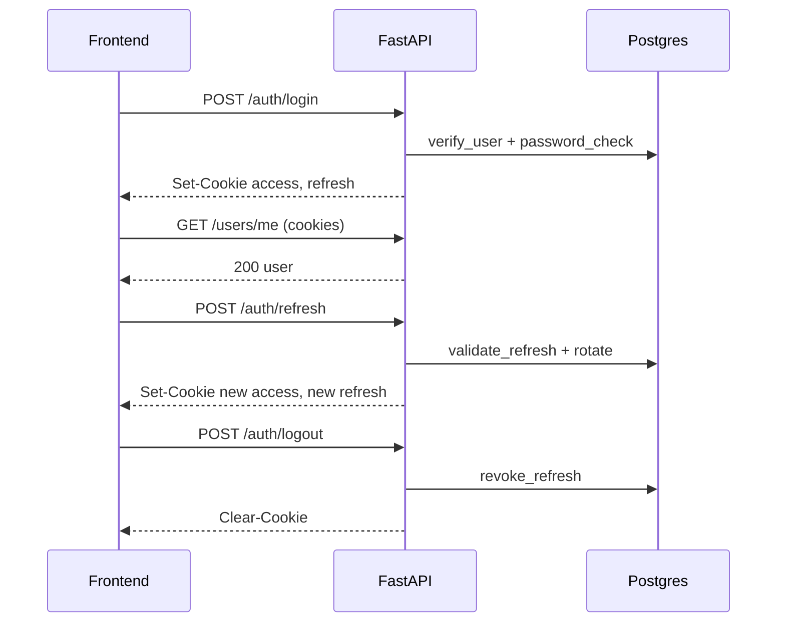

# Backend scaffolding plan (FastAPI + Postgres + async SQLAlchemy)

## Goals

- Stand up a **local-dev ready** backend with:
  - FastAPI (async) + Uvicorn
  - Postgres (Docker for dev; Neon-ready config for prod)
  - SQLAlchemy 2.x **async** + Alembic migrations
  - OAuth2-style login with **JWT access+refresh in HttpOnly cookies**
  - Pydantic v2 settings/schema validation
  - pytest baseline + GitHub Actions CI
  - Railway-friendly runtime entrypoint

## High-level repo layout

- Replace the current Node scaffold under `backend/` with a Python app:
  - [`backend/app/main.py`](/Users/yuval/Downloads/class-mate/backend/app/main.py) FastAPI app + routers
  - [`backend/app/core/settings.py`](/Users/yuval/Downloads/class-mate/backend/app/core/settings.py) Pydantic v2 `BaseSettings`
  - [`backend/app/core/security.py`](/Users/yuval/Downloads/class-mate/backend/app/core/security.py) bcrypt + JWT helpers
  - [`backend/app/db/session.py`](/Users/yuval/Downloads/class-mate/backend/app/db/session.py) async engine/session
  - [`backend/app/db/base.py`](/Users/yuval/Downloads/class-mate/backend/app/db/base.py) SQLAlchemy Base + model imports
  - [`backend/app/models/`](/Users/yuval/Downloads/class-mate/backend/app/models/) e.g. `User`, `RefreshToken` (optional)
  - [`backend/app/api/v1/`](/Users/yuval/Downloads/class-mate/backend/app/api/v1/) versioned API routers
  - [`backend/alembic/`](/Users/yuval/Downloads/class-mate/backend/alembic/) migrations
  - [`backend/tests/`](/Users/yuval/Downloads/class-mate/backend/tests/) pytest

## Dependencies & tooling

- Python packaging (pick one):
  - **Option A (recommended)**: `pyproject.toml` + Poetry
  - Option B: `pyproject.toml` + uv
  - Option C: `requirements.txt` + venv
- Core packages (pinned/compatible):
  - `fastapi`, `uvicorn[standard]`, `pydantic`, `pydantic-settings`
  - `sqlalchemy[asyncio]`, `asyncpg`, `alembic`
  - `python-jose[cryptography] `(JWT) or `pyjwt`
  - `passlib[bcrypt]` (bcrypt hashing)
  - `python-multipart` (form login) + `httpx` (tests)
  - `pytest`, `pytest-asyncio`

## Local dev services (Docker)

- Add [`backend/docker-compose.yml`](/Users/yuval/Downloads/class-mate/backend/docker-compose.yml) providing:
  - Postgres service
  - A named volume for persistence
- Add env template [`backend/env.example`](/Users/yuval/Downloads/class-mate/backend/env.example) (non-dotfile) with:
  - `DATABASE_URL=postgresql+asyncpg://...`
  - `JWT_SECRET`, `JWT_ACCESS_TTL_SECONDS`, `JWT_REFRESH_TTL_SECONDS`
  - `COOKIE_DOMAIN`, `COOKIE_SECURE`, `CORS_ORIGINS`

## Database layer (async SQLAlchemy 2)

- Implement:
  - Async engine/session factory (dependency `get_db()`)
  - Base model (`DeclarativeBase`)
  - First model set:
    - `User(id, email, password_hash, is_active, created_at)`
    - (Recommended) `RefreshToken(id, user_id, token_hash, expires_at, revoked_at, created_at)` for rotation/revocation
- Alembic:
  - Configure `alembic/env.py` to run against async engine using sync bridge.
  - Create initial migration for tables.

## Auth (HttpOnly cookies, access + refresh)

- Endpoints (v1):
  - `POST /api/v1/auth/login` (email/password) sets cookies
  - `POST /api/v1/auth/refresh` rotates refresh token, resets cookies
  - `POST /api/v1/auth/logout` clears cookies + revokes refresh token
  - `GET /api/v1/users/me` returns current user
- Cookie strategy:
  - Access cookie: short TTL (e.g. 15m)
  - Refresh cookie: longer TTL (e.g. 14–30d)
  - `HttpOnly`, `SameSite=Lax` (or `None` if cross-site), `Secure` in prod
- Rotation policy:
  - Each refresh call issues a new refresh token and revokes the previous one (DB-backed)

## API structure & middleware

- Versioned router: `/api/v1`
- CORS configured for your dev frontend (likely `http://localhost:5173`)
- Health endpoint: `GET /health`
- Central error handling (validation + common API errors)

## Testing baseline (pytest)

- Add:
  - DB fixtures (test database or transaction rollback)
  - Auth tests: login, refresh rotation, logout
  - A simple route test: `/health`
- Prefer `httpx.AsyncClient` against FastAPI app.

## CI/CD (GitHub Actions) + Deployment (Railway)

- GitHub Actions:
  - Run `pytest` and minimal lint/format step (optional: ruff)
- Railway:
  - Uvicorn start command (e.g. `uvicorn app.main:app --host 0.0.0.0 --port $PORT`)
  - Use `DATABASE_URL` from Railway/Neon

## Future-ready hooks (LangGraph/LlamaIndex/pgvector, S3)

- Don’t implement now; leave extension points:
  - `app/services/storage/` (S3 client wrapper)
  - `app/services/rag/` (future)
  - DB migration note for enabling `pgvector` extension later

## What I’ll do after you accept this plan

- Remove the Node/Express backend files currently in `backend/` and create the Python scaffold.
- Add Docker-based Postgres for local dev and wire async SQLAlchemy + Alembic.
- Implement cookie-based JWT auth + initial user model + tests.
- Add root-level documentation and scripts to run frontend + backend together.